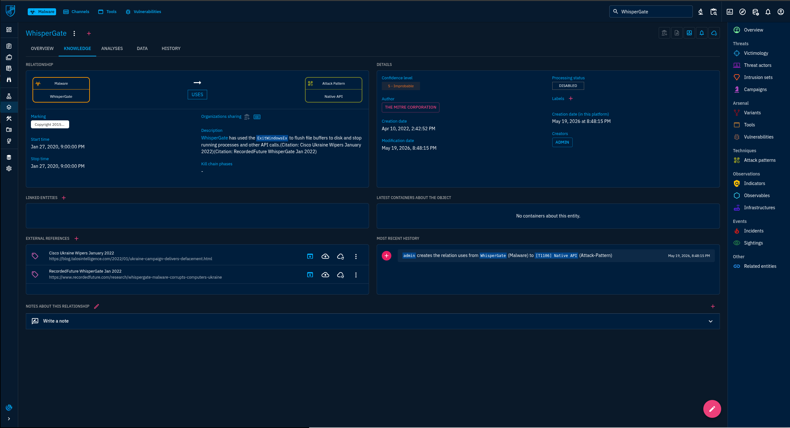
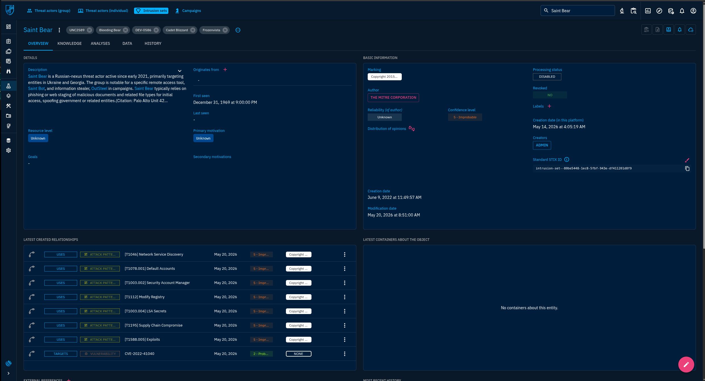
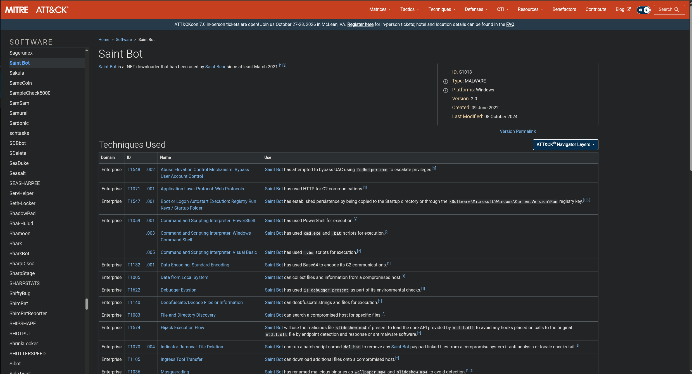
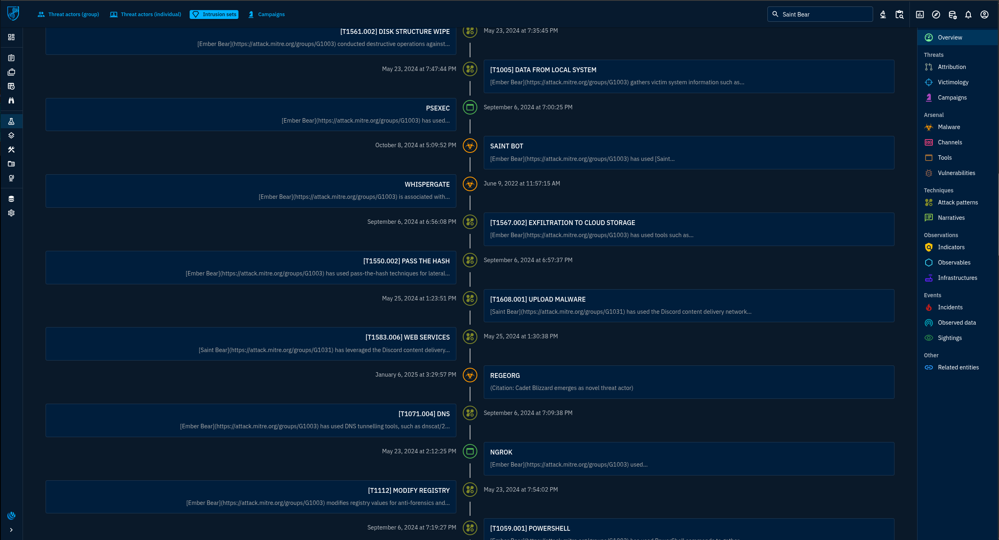
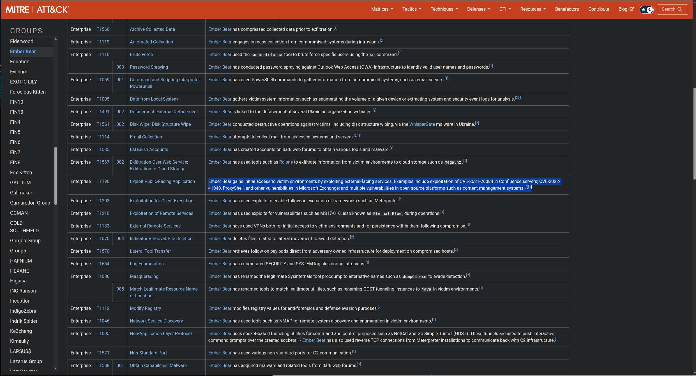

# Threat Intelligence com OpenCTI: WhisperGate & Saint Bear - CTF Walkthrough

## 📋 Descrição

Este é um desafio de Threat Intelligence onde atuamos como analista de CTI em um **MSSP global** que atende clientes de infraestrutura crítica. Uma onda de ataques destrutivos atingiu setores relacionados aos clientes, e a missão é perfilar duas ameaças emergentes na instância **OpenCTI**: a família de malware **WhisperGate** e o intrusion set **Saint Bear**.

O objetivo é investigar e coletar dados no OpenCTI (e validar no MITRE ATT&CK) para construir um brief rápido de inteligência para as equipes de resposta a incidentes, com foco em **linhas do tempo** e **TTPs** que apoiem a detecção.

### Ambiente

```
Plataforma: OpenCTI
Fonte de validação: MITRE ATT&CK
Entidades analisadas: WhisperGate (Malware) e Saint Bear (Intrusion Set)
```

> **Nota**: Os dados do laboratório vêm do conector do MITRE e possuem confiança "5 - Improbable" na maioria das relações, o que é esperado nesse ambiente de treinamento.

---

## 🔍 Investigação e Resolução

### 1️⃣ Quantas relações de attack pattern estão ligadas ao malware WhisperGate?

**Localização:** `Arsenal > Malware > WhisperGate > Knowledge > Overview`

**Análise:**
No painel *Distribution of relations* aparecem 29 relações no total, divididas em:
- 28 Attack Pattern
- 1 Intrusion Set

**Resposta:** `28`


---

### 2️⃣ Qual utilitário do Windows o WhisperGate usa para desabilitar o Windows Defender?

**Localização:** `WhisperGate > Knowledge > Attack patterns`, relação `uses` com `[T1218.004] InstallUtil`

**Análise:**
A descrição da relação indica que o WhisperGate usou o `InstallUtil.exe` como parte do processo para desabilitar o Windows Defender (técnica de Signed Binary Proxy Execution).

**Resposta:** `InstallUtil` (InstallUtil.exe)


---

### 3️⃣ Qual função de Native API o WhisperGate usa para desligar um host comprometido?

**Localização:** `WhisperGate > Knowledge > Attack patterns`, relação `uses` com `[T1106] Native API`

**Análise:**
A descrição da relação indica que o malware usou a função `ExitWindowsEx` para descarregar os buffers de arquivo em disco e encerrar processos e outras chamadas de API.

**Resposta:** `ExitWindowsEx`



---

### 4️⃣ Qual o nome do malware downloader comumente associado ao OutSteel nas campanhas do Saint Bear?

**Localização:** `Threats > Intrusion sets > Saint Bear > Overview` e MITRE ATT&CK (Software)

**Análise:**
A descrição do Saint Bear cita a ferramenta de acesso remoto **Saint Bot** e o information stealer **OutSteel**. No MITRE ATT&CK, o Saint Bot é descrito como um **downloader .NET** usado pelo Saint Bear desde pelo menos março de 2021.

**Resposta:** `Saint Bot`





---

### 5️⃣ Qual ferramenta o Saint Bear usou para exfiltrar dados para serviços de armazenamento em nuvem?

**Localização:** `Saint Bear > Knowledge > Overview` (timeline) e MITRE ATT&CK (Software)

**Análise:**
Na timeline aparece a técnica `[T1567.002] Exfiltration to Cloud Storage`. O MITRE ATT&CK confirma que o **Rclone** é um programa de linha de comando para sincronizar arquivos com serviços de nuvem como Dropbox, Google Drive, Amazon S3 e MEGA, e a página do grupo Ember Bear cita seu uso para exfiltrar dados para o `mega.nz`.

**Resposta:** `Rclone`




---

### 6️⃣ Qual vulnerabilidade do Microsoft Exchange o Saint Bear foi visto explorando?

**Localização:** `Saint Bear > Overview > Latest created relationships` e MITRE ATT&CK (T1190)

**Análise:**
No painel de relações aparece `TARGETS → Vulnerability → CVE-2022-41040`. A técnica *Exploit Public-Facing Application (T1190)* do grupo com atividade sobreposta no MITRE lista a CVE-2022-41040 e o ProxyShell como vulnerabilidades do Microsoft Exchange usadas para acesso inicial.

**Resposta:** `CVE-2022-41040`




---

## 🎯 Conclusão

Este desafio mostrou como o OpenCTI e o MITRE ATT&CK se complementam para transformar dados brutos em inteligência acionável para IR.

### Técnicas de Ataque Identificadas:
1. **Acesso Inicial** - Exploração de aplicações públicas (T1190): Exchange (CVE-2022-41040, ProxyShell), Confluence e CMS
2. **Execução** - Scripts PowerShell e Visual Basic (T1059.001 e T1059.005)
3. **Evasão de Defesa** - InstallUtil para desabilitar o Defender (T1218.004), masquerading (T1036) e modificação de registro (T1112)
4. **Movimentação Lateral** - Pass the Hash (T1550.002)
5. **Comando e Controle** - Ingress Tool Transfer (T1105) e Web Service (T1102)
6. **Exfiltração** - Rclone para armazenamento em nuvem (T1567.002)
7. **Impacto** - Disk Structure Wipe (T1561.002), defacement (T1491.002) e `ExitWindowsEx` via Native API (T1106)

### Artefatos Importantes para Detecção:
- Execução de `InstallUtil.exe` por processos pai ou caminhos incomuns
- Alterações na configuração do Windows Defender
- Execução e arquivos de configuração do Rclone, e conexões para `mega.nz`
- Status de patch dos servidores Exchange e web shells no IIS
- Binários disfarçados com extensões `.jpg` ou `.mp4` (ex.: `wallpaper.mp4`, `slideshow.mp4` do Saint Bot)
- Novos valores em `HKCU\Software\Microsoft\Windows\CurrentVersion\Run` e na pasta Startup
- Escritas diretas no disco (MBR) e exclusão em massa de arquivos

### Lições Aprendidas:
- O Saint Bear é rastreado com vários aliases (UNC2589, Bleeding Bear, DEV-0586, Cadet Blizzard, Frozenvista), e o MITRE trata atividade sobreposta como Ember Bear (G1003); sobreposição de entidades exige cuidado em atribuição
- Datas inconsistentes na plataforma (ex.: *First seen* `Dec 31, 1969`, que é o epoch Unix, e start date de 2020 na relação do Native API) são problemas de qualidade de dados e devem ser corrigidos antes de alimentar a detecção
- Relações com confiança "Improbable" precisam ser enriquecidas e validadas antes de virarem alertas
- Validar sempre o dado do OpenCTI contra uma fonte externa como o MITRE ATT&CK

### Resumo das Respostas:

| # | Pergunta | Resposta |
|---|---|---|
| 1 | Relações de attack pattern ligadas ao WhisperGate | `28` |
| 2 | Utilitário usado para desabilitar o Windows Defender | `InstallUtil` |
| 3 | Função de Native API usada para desligar o host | `ExitWindowsEx` |
| 4 | Downloader associado ao OutSteel | `Saint Bot` |
| 5 | Ferramenta usada para exfiltrar para a nuvem | `Rclone` |
| 6 | Vulnerabilidade do Exchange explorada | `CVE-2022-41040` |

---

## 📚 Referências

- [OpenCTI Platform](https://docs.opencti.io/)
- [MITRE ATT&CK - WhisperGate (S0689)](https://attack.mitre.org/software/S0689/)
- [MITRE ATT&CK - Ember Bear (G1003)](https://attack.mitre.org/groups/G1003/)
- [MITRE ATT&CK - Saint Bot (S1018)](https://attack.mitre.org/software/S1018/)
- [MITRE ATT&CK - Rclone (S1040)](https://attack.mitre.org/software/S1040/)
- [MITRE ATT&CK - T1190 Exploit Public-Facing Application](https://attack.mitre.org/techniques/T1190/)

---

## ⚠️ Aviso Legal

Este conteúdo possui **fins exclusivamente educacionais** e foi realizado em ambiente controlado de CTF. Os achados refletem os dados presentes na instância OpenCTI do laboratório e nas páginas públicas do MITRE ATT&CK.

---

## 👤 Autor

**iceShaher**
- TryHackMe: [@iceShaher](https://tryhackme.com/p/iceShaher)
