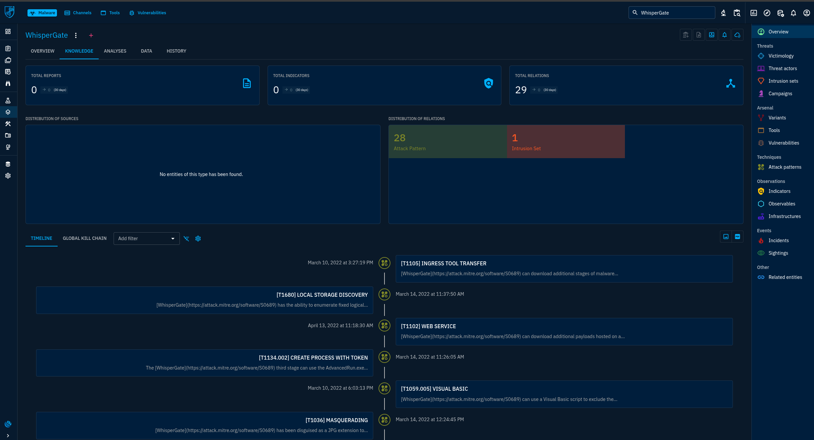
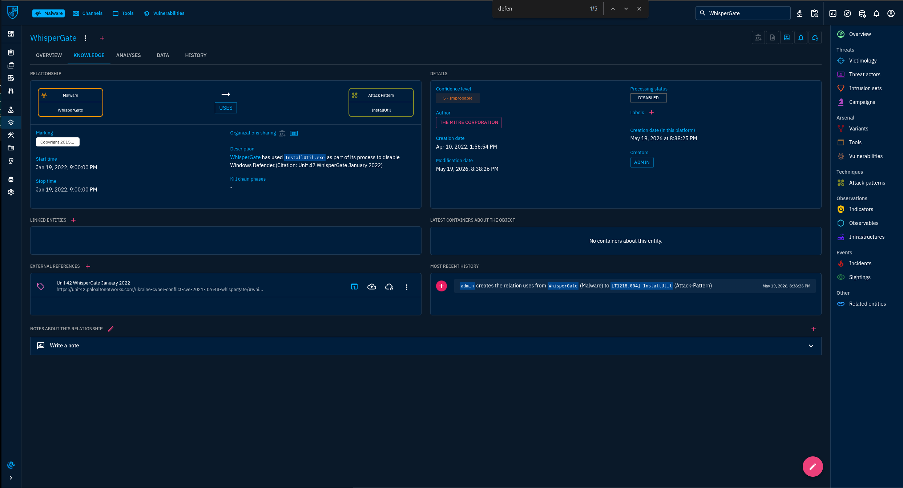
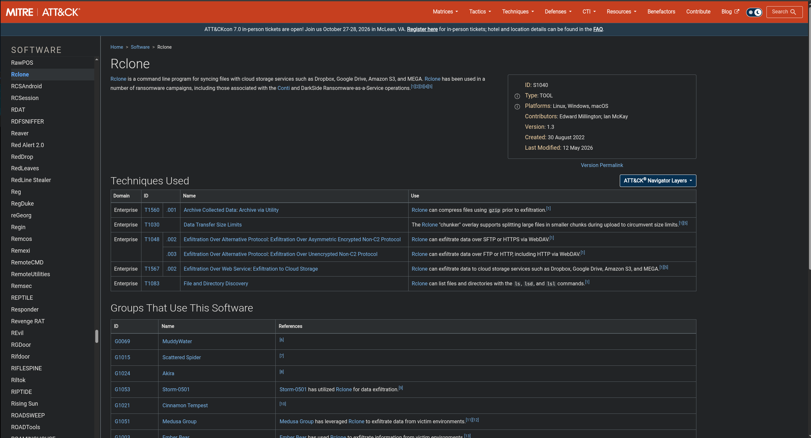

# 🛡️ Brief de Threat Intelligence: WhisperGate & Saint Bear (OpenCTI)

> Perfilamento de uma família de malware destrutivo e do conjunto de intrusão por trás dele, usando **OpenCTI** e **MITRE ATT&CK**, para apoiar detecção e resposta a incidentes.


---

## 📌 Cenário

Atuei como **Analista de Threat Intelligence em um MSSP global** que atende clientes de infraestrutura crítica. Uma onda de ataques destrutivos atingiu setores relacionados aos clientes, e meu time foi encarregado de perfilar duas ameaças emergentes dentro da nossa instância OpenCTI:

- **WhisperGate** (família de malware)
- **Saint Bear** (intrusion set)

**Objetivo:** construir um brief rápido de inteligência para as equipes de resposta a incidentes, com foco em **linhas do tempo** e **TTPs** para apoiar a engenharia de detecção.

## 🧰 Ferramentas e Fontes

| Ferramenta / Fonte | Uso |
|---|---|
| OpenCTI | Base de conhecimento central: entidades, relacionamentos, timelines, kill chain |
| MITRE ATT&CK | Validação cruzada de técnicas, softwares e grupos |

## 🔎 Metodologia

1. Busquei a entidade no OpenCTI (`Arsenal > Malware` / `Threats > Intrusion sets`).
2. Usei a aba **Knowledge** para revisar relacionamentos, distribuição e timeline.
3. Abri relações individuais `uses` / `targets` para ler descrições, datas e referências externas.
4. Cruzei os achados com o MITRE ATT&CK (páginas de Software e Groups).

---

## 🧪 Investigação e Achados

### 1️⃣ Quantas relações de attack pattern estão ligadas ao WhisperGate?

Na aba **Knowledge > Overview** do WhisperGate, o painel *Distribution of relations* mostra 29 relações no total: **28 Attack Pattern** e 1 Intrusion Set.



✅ **Resposta: `28`**

---

### 2️⃣ Qual utilitário do Windows o WhisperGate usa para desabilitar o Windows Defender?

A relação `WhisperGate → uses → [T1218.004] InstallUtil` descreve o malware usando o `InstallUtil.exe` como parte do processo para desabilitar o Windows Defender (Signed Binary Proxy Execution: InstallUtil).



✅ **Resposta: `InstallUtil` (InstallUtil.exe)**

---

### 3️⃣ Qual função de Native API o WhisperGate usa para desligar um host comprometido?

A relação `WhisperGate → uses → [T1106] Native API` indica que o malware usou a função `ExitWindowsEx` para descarregar os buffers de arquivo em disco e encerrar processos e outras chamadas de API.


✅ **Resposta: `ExitWindowsEx`**

---

### 4️⃣ Qual o nome do malware downloader comumente associado ao OutSteel nas campanhas do Saint Bear?

A descrição do Saint Bear no OpenCTI cita a ferramenta de acesso remoto **Saint Bot** e o information stealer **OutSteel**. O MITRE ATT&CK descreve o Saint Bot como um **downloader .NET** usado pelo Saint Bear desde pelo menos março de 2021.


✅ **Resposta: `Saint Bot`**

---

### 5️⃣ Qual ferramenta o Saint Bear usou para exfiltrar dados para serviços de armazenamento em nuvem?

Na timeline do Saint Bear aparece a técnica `[T1567.002] Exfiltration to Cloud Storage`. O MITRE ATT&CK confirma que o **Rclone** é um programa de linha de comando para sincronizar arquivos com serviços de nuvem (Dropbox, Google Drive, Amazon S3, MEGA), e a página do grupo Ember Bear cita seu uso para exfiltrar para `mega.nz`.




✅ **Resposta: `Rclone`**

---

### 6️⃣ Qual vulnerabilidade do Microsoft Exchange o Saint Bear foi visto explorando?

No painel **Latest created relationships** do Saint Bear há a relação `TARGETS → Vulnerability → CVE-2022-41040`. A entrada *Exploit Public-Facing Application (T1190)* do MITRE para o grupo com atividade sobreposta lista CVE-2022-41040 e ProxyShell como vulnerabilidades do Microsoft Exchange usadas para acesso inicial.


✅ **Resposta: `CVE-2022-41040`**

---

## 📋 Resumo das Respostas

| # | Pergunta | Resposta |
|---|---|---|
| 1 | Relações de attack pattern ligadas ao WhisperGate | **28** |
| 2 | Utilitário usado para desabilitar o Windows Defender | **InstallUtil** |
| 3 | Função de Native API usada para desligar o host | **ExitWindowsEx** |
| 4 | Downloader associado ao OutSteel | **Saint Bot** |
| 5 | Ferramenta usada para exfiltrar para a nuvem | **Rclone** |
| 6 | Vulnerabilidade do Exchange explorada | **CVE-2022-41040** |

---

## 🧾 Brief Rápido de Inteligência para Times de IR

### Perfil da ameaça

- O **Saint Bear** é um ator com nexo russo, ativo desde o início de 2021, que mira principalmente Ucrânia e Geórgia. Costuma usar phishing ou hospedagem web de documentos maliciosos para acesso inicial, imitando entidades governamentais ou relacionadas.
- **Aliases no OpenCTI:** UNC2589, Bleeding Bear, DEV-0586, Cadet Blizzard, Frozenvista.
- **Arsenal:** WhisperGate (destrutivo), Saint Bot (downloader), OutSteel (stealer), Rclone (exfiltração), PsExec e Ngrok (ferramentas), entre outros.
- **Nota sobre nomenclatura:** o MITRE rastreia atividade sobreposta como **Ember Bear (G1003)**, por isso técnicas do Ember Bear aparecem na timeline do Saint Bear. Sobreposição de entidades e aliases é um clássico ponto de atenção em atribuição e deve ser validada antes de reportar a um cliente.

### Mapa de kill chain / TTPs

| Fase | Técnica | Comportamento observado |
|---|---|---|
| Acesso Inicial | T1190 Exploit Public-Facing Application | Vulnerabilidades do Exchange (CVE-2022-41040, ProxyShell), Confluence e CMS |
| Execução | T1059.001 / T1059.005 | Scripts PowerShell e Visual Basic |
| Evasão de Defesa | T1218.004 InstallUtil | Usado para desabilitar o Windows Defender |
| Evasão de Defesa | T1036 Masquerading | Payloads disfarçados com extensão JPG; Saint Bot renomeia binários como `wallpaper.mp4` / `slideshow.mp4` |
| Evasão de Defesa | T1112 Modify Registry | Anti-forense e evasão de defesa |
| Acesso a Credenciais | T1550.002 Pass the Hash | Movimentação lateral |
| Descoberta | T1046, T1680 | Descoberta de serviços de rede; descoberta de armazenamento local |
| Comando e Controle | T1105 Ingress Tool Transfer, T1102 Web Service | Download de estágios e payloads adicionais |
| Exfiltração | T1567.002 | Rclone para nuvem (ex.: `mega.nz`) |
| Impacto | T1561.002 Disk Structure Wipe, T1491.002 Defacement | Operações destrutivas contra organizações ucranianas |
| Impacto | T1106 Native API | `ExitWindowsEx` para encerrar processos e descarregar buffers |

### Ideias de detecção

- **InstallUtil.exe** iniciado por processos pai ou caminhos incomuns, ou interagindo com a configuração do Defender.
- **Adulteração do Defender:** mudanças em exclusões, estado do serviço ou proteção em tempo real.
- **Rclone:** execução e arquivos de configuração em servidores, além de conexões de saída para armazenamento em nuvem como `mega.nz`.
- **Servidores Exchange:** revisar o status de patch para CVE-2022-41040 e ProxyShell e procurar web shells e processos filhos suspeitos do worker do IIS.
- **Masquerading:** extensões de mídia ou imagem (`.jpg`, `.mp4`) carregadas como executáveis ou DLLs.
- **Persistência:** novos valores em `HKCU\Software\Microsoft\Windows\CurrentVersion\Run` e arquivos na pasta Startup.
- **Precursores destrutivos:** escritas diretas no disco (MBR), chamadas inesperadas de API de desligamento e exclusão em massa de arquivos.

### Observações de timeline

- As relações do WhisperGate no OpenCTI têm datas de **janeiro de 2022**, coerentes com a campanha pública contra a Ucrânia.
- Algumas relações têm datas estranhas (por exemplo, start date de `Jan 27, 2020` na relação do Native API), e o intrusion set Saint Bear mostra *First seen* como `Dec 31, 1969`, que é o valor padrão do epoch Unix. São **problemas de qualidade de dados da plataforma**, não observações reais, e devem ser sinalizados e corrigidos antes de alimentar trabalho de detecção.
- A maioria das relações tem confiança **5 - Improbable**, então deve ser enriquecida e validada antes de ser tratada como alta confiança.

---

## 📁 Estrutura do Repositório

```
.
├── README.md
└── screenshots/
    ├── 01-whispergate-relations-overview.png
    ├── 02-whispergate-installutil-defender.png
    ├── 03-whispergate-native-api-exitwindowsex.png
    ├── 04-saint-bot-mitre.png
    ├── 05-rclone-mitre.png
    ├── 06-ember-bear-initial-access-cves.png
    ├── 07-saint-bear-opencti-overview.png
    └── 08-saint-bear-ttp-timeline.png
```

## 🎓 Competências Demonstradas

- Análise de Cyber Threat Intelligence com **OpenCTI** (entidades, relacionamentos, timelines)
- Mapeamento e validação cruzada com **MITRE ATT&CK**
- Raciocínio de detecção orientado a TTPs e relatórios voltados a IR
- Ressalvas de atribuição e avaliação de qualidade de dados

## ⚠️ Aviso

Este projeto foi construído a partir de um ambiente de CTF de treinamento, apenas para fins educacionais e de portfólio. Os achados refletem os dados presentes na instância OpenCTI do laboratório e nas páginas públicas do MITRE ATT&CK.

## 👤 Autor

**Seu Nome** · [LinkedIn](https://www.linkedin.com/in/seu-perfil) · [GitHub](https://github.com/seu-usuario)
