# Investigating Windows - TryHackMe CTF Walkthrough

## 📋 Descrição

Este é um desafio de forense digital onde uma máquina Windows foi comprometida e precisamos investigar para descobrir o que o atacante fez. O objetivo é analisar logs, tarefas agendadas, contas de usuário e outros artefatos do sistema para reconstruir o ataque.


### Credenciais

```
Usuário: Administrator
Senha: letmein123!
```

### Conexão via RDP

```bash
xfreerdp /v:MACHINE_IP /u:Administrator /p:letmein123! /dynamic-resolution
```

> **Nota**: A máquina não responde a ping (ICMP) e pode levar alguns minutos para inicializar.

---

## 🔍 Investigação e Resolução

### 1️⃣ Qual a versão e ano da máquina Windows?

**Comando utilizado:**
```powershell
systeminfo
```

**Resultado:**
```
OS Name: Microsoft Windows Server 2016 Datacenter
OS Version: 10.0.14393 N/A Build 14393
```

**Resposta:** `Windows Server 2016`

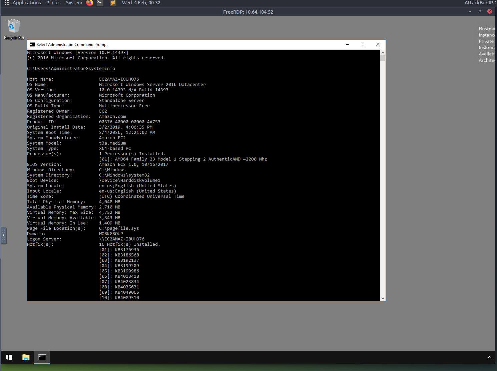

---

### 2️⃣ Qual usuário fez login por último?

**Comando utilizado:**
```powershell
net user
```

**Análise:**
Listando todos os usuários do sistema, identificamos os seguintes usuários:
- Administrator
- DefaultAccount
- Guest
- Jenny
- John

**Resposta:** `Administrator`

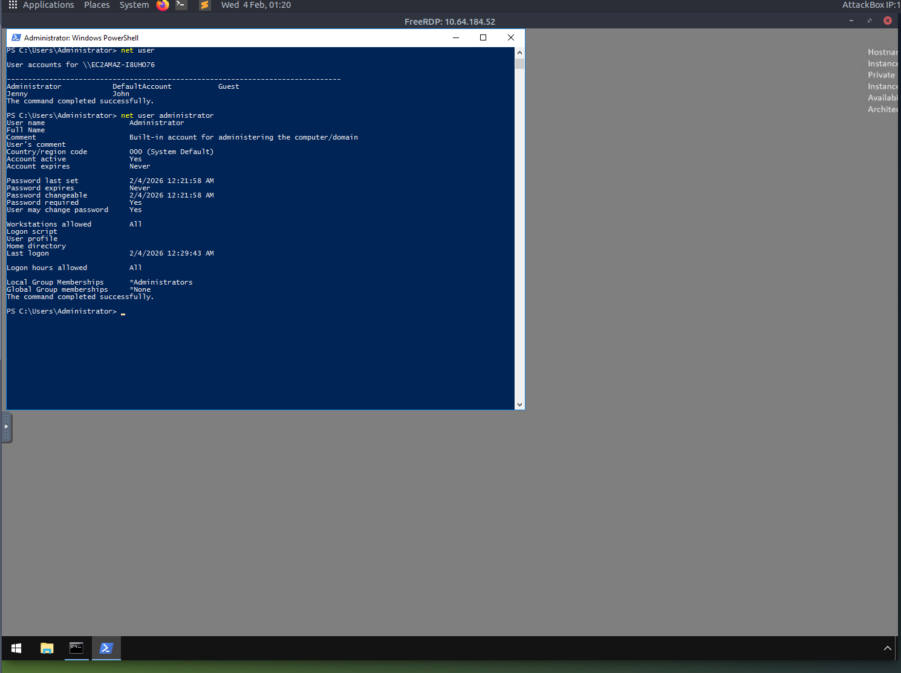

---

### 3️⃣ Quando John fez login no sistema pela última vez?

**Comando utilizado:**
```powershell
net user John
```

**Resultado:**
```
Last logon: 3/2/2019 5:48:32 PM
```

**Resposta:** `03/02/2019 5:48:32 PM`

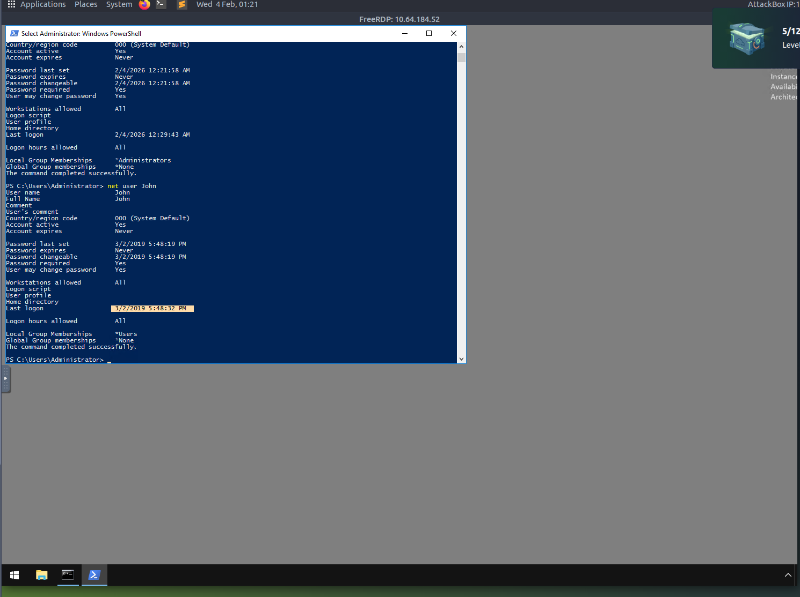

---

### 4️⃣ A qual IP o sistema se conecta quando inicia?

**Localização:** Verificando os programas de inicialização

**Análise:**
O sistema executa `C:\TMP\p.exe` na inicialização, que se conecta ao IP:

**Resposta:** `10.34.2.3`

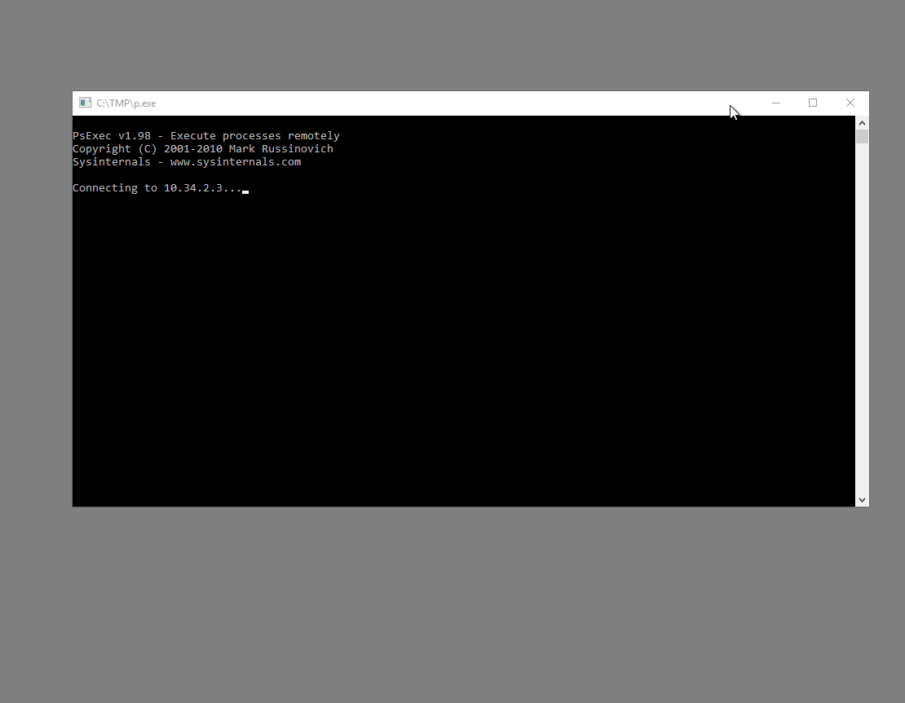

---

### 5️⃣ Quais duas contas tinham privilégios administrativos (além do usuário Administrator)?

**Comando utilizado:**
```powershell
net localgroup administrators
```

**Resultado:**
```
Members
-------------------------------------------------------------------------------
Administrator
Guest
Jenny
```

**Resposta:** `Guest, Jenny`

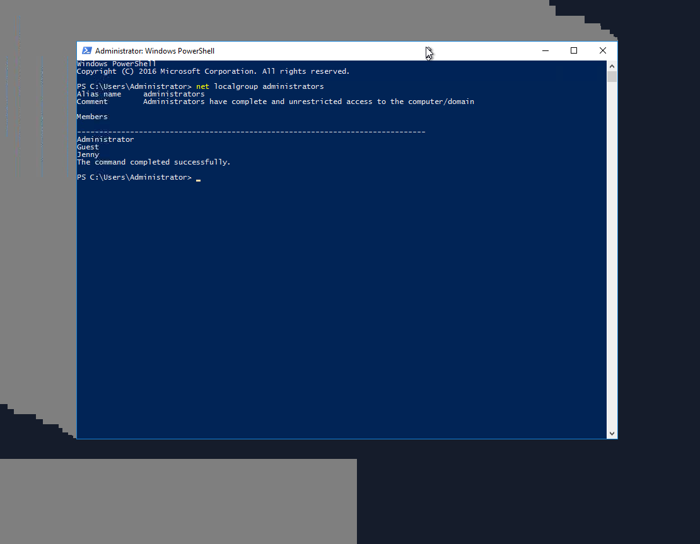

---

### 6️⃣ Qual o nome da tarefa agendada maliciosa?

**Comando utilizado:**
```powershell
Get-ScheduledTask
```

**Análise:**
Ao listar as tarefas agendadas, identificamos uma tarefa suspeita:

**Resposta:** `Clean file system`

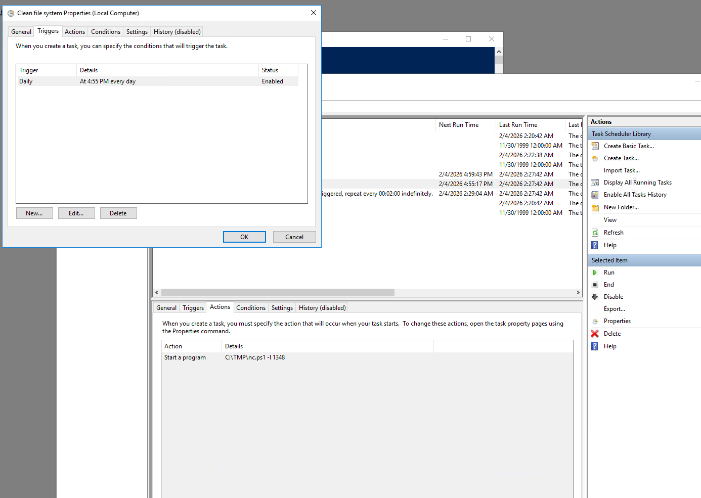

---

### 7️⃣ Qual arquivo a tarefa tentava executar diariamente?

**Comando utilizado:**
```powershell
(Get-ScheduledTask -TaskName "Clean file system").Actions
```

**Resultado:**
```
Execute: C:\TMP\nc.ps1
Arguments: -l 1348
```

**Resposta:** `nc.ps1`


---

### 8️⃣ Em qual porta esse arquivo escutava localmente?

**Análise:**
Conforme visto anteriormente, o script PowerShell estava configurado para escutar na porta especificada pelo argumento `-l`.

**Resposta:** `1348`

---

### 9️⃣ Quando Jenny fez login pela última vez?

**Comando utilizado:**
```powershell
net user Jenny
```

**Resultado:**
```
Last logon: Never
```

**Análise:**
Apesar de Jenny ter uma conta com privilégios administrativos, ela nunca fez login no sistema.

**Resposta:** `Never`

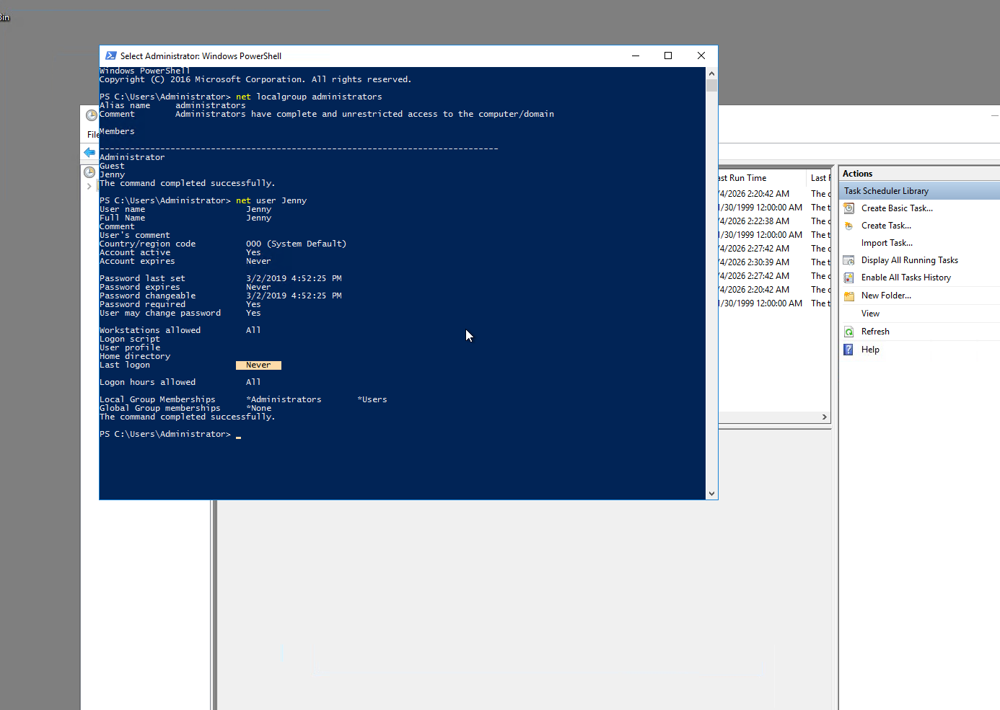

---

### 🔟 Em que data o comprometimento ocorreu?

**Análise:**
Através da análise dos logs de eventos do Windows (Event Viewer), identificamos que:
- As tarefas agendadas suspeitas foram criadas em 2 de março de 2019
- Jenny e Guest foram adicionados ao grupo Administrators na mesma data
- Arquivos maliciosos em `C:\TMP` foram criados nesta data

**Comando para verificar:**
```powershell
Get-ChildItem C:\TMP | Select-Object Name, CreationTime
```

**Resposta:** `03/02/2019`

---

### 1️⃣1️⃣ Durante o comprometimento, em que horário o Windows atribuiu privilégios especiais a um novo logon pela primeira vez?

**Análise:**
Consultando o Event Viewer para o Event ID 4672 (Special Privileges Assigned to New Logon):

**Comando utilizado:**
```powershell
$Specials = Get-WinEvent -LogName "Security" | Where-Object {$_.Id -eq "4672"}
$Specials.TimeCreated
```

**Resposta:** `03/02/2019 4:04:49 PM`

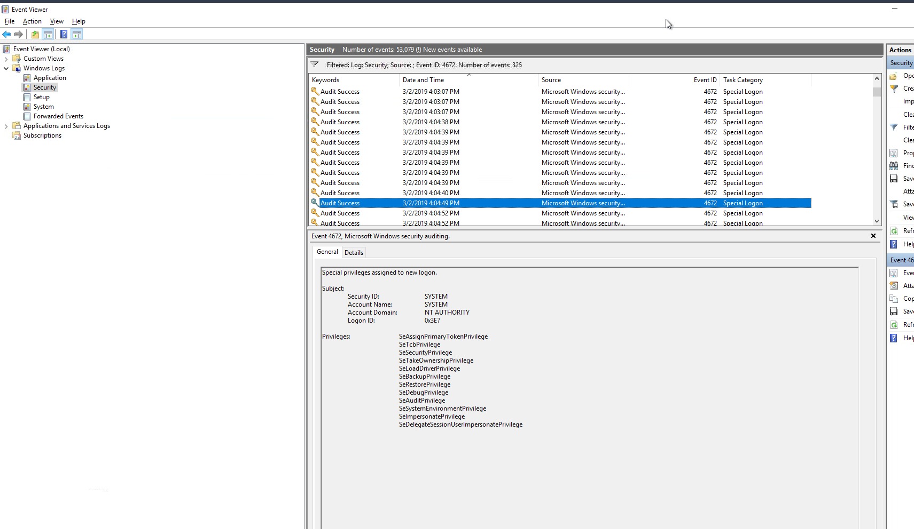

---

### 1️⃣2️⃣ Qual ferramenta foi usada para obter senhas do Windows?

**Localização:** `C:\TMP\mim-out.txt`

**Comando utilizado:**
```powershell
Get-Content C:\TMP\mim-out.txt
```

**Análise:**
O arquivo de saída mostra claramente o uso do Mimikatz, uma ferramenta conhecida para extração de credenciais do Windows.

**Resposta:** `Mimikatz`

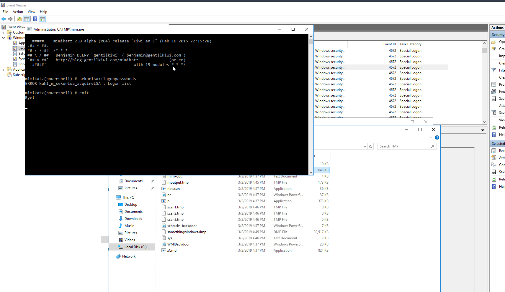

---

### 1️⃣3️⃣ Qual era o IP do servidor de comando e controle (C2) externo do atacante?

**Localização:** `C:\Windows\System32\drivers\etc\hosts`

**Comando utilizado:**
```powershell
Get-Content C:\Windows\System32\drivers\etc\hosts
```

**Análise:**
O arquivo hosts foi modificado para incluir entradas maliciosas.

**Resposta:** `76.32.97.132`

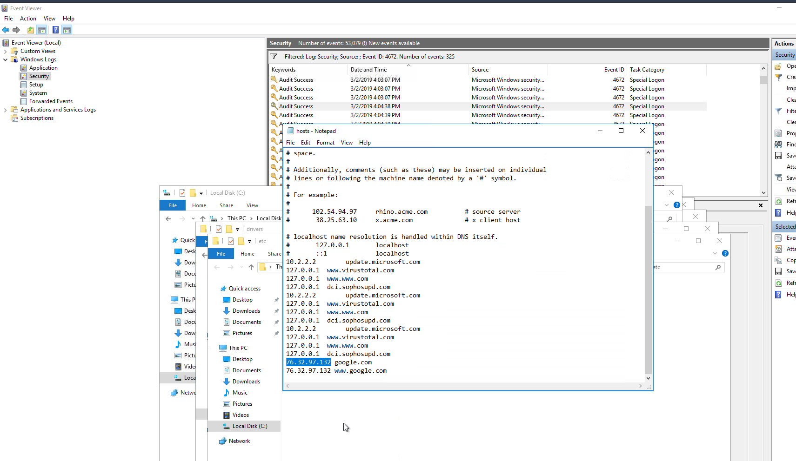

---

### 1️⃣4️⃣ Qual era a extensão do shell enviado através do site do servidor?

**Localização:** `C:\inetpub\wwwroot`

**Comando utilizado:**
```powershell
Get-ChildItem C:\inetpub\wwwroot | Select-Object Name, CreationTime
```

**Análise:**
Encontramos um arquivo `tests.jsp` no diretório do webserver, indicando que o atacante fez upload de uma webshell JSP.

**Resposta:** `.jsp`

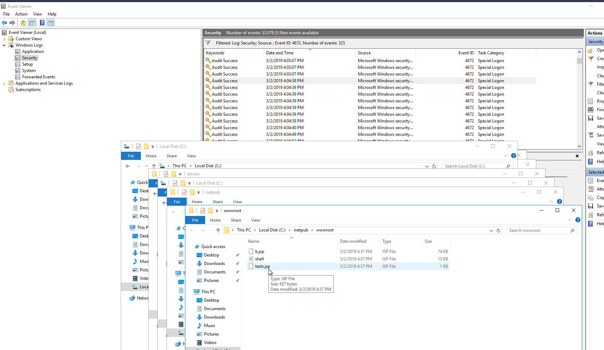

---

### 1️⃣5️⃣ Qual foi a última porta aberta pelo atacante?

**Localização:** Windows Firewall → Advanced Settings → Inbound Rules

**Análise:**
Verificando as regras de firewall, encontramos uma regra permitindo conexões na porta:

**Resposta:** `1337`

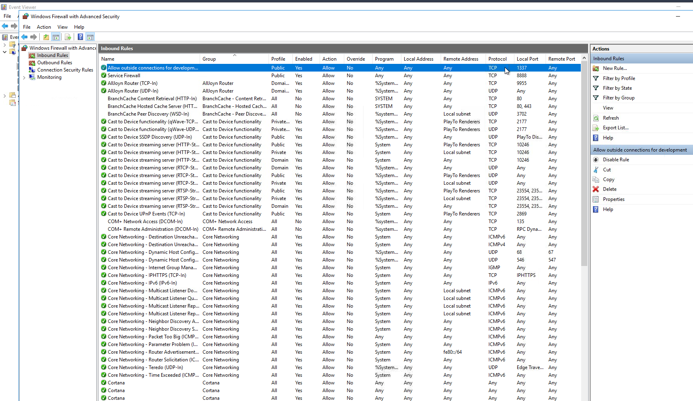

---

### 1️⃣6️⃣ Verificando envenenamento de DNS, qual site foi alvo?

**Comando utilizado:**
```powershell
Get-Content C:\Windows\System32\drivers\etc\hosts
```

**Análise:**
O arquivo hosts foi modificado para redirecionar tráfego de um site legítimo para o IP do atacante.

**Resposta:** `google.com`

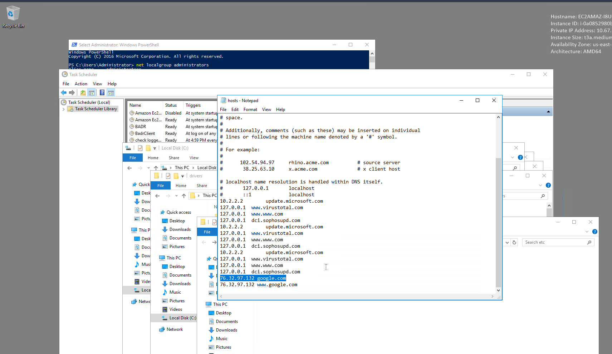

---

## 🎯 Conclusão

Este desafio demonstrou várias técnicas comuns de comprometimento em ambientes Windows:

### Técnicas de Ataque Identificadas:
1. **Upload de Webshell** - Arquivo JSP malicioso
2. **Persistência** - Tarefas agendadas executando scripts PowerShell
3. **Escalação de Privilégios** - Adição de usuários ao grupo Administrators
4. **Credential Dumping** - Uso do Mimikatz
5. **Command & Control** - Conexão com servidor externo via netcat
6. **DNS Poisoning** - Modificação do arquivo hosts
7. **Evasão** - Regras de firewall customizadas

### Artefatos Forenses Importantes:
- Event Logs (Event IDs 4624, 4672, 4732)
- Tarefas agendadas
- Arquivo hosts
- Regras de firewall
- Arquivos em diretórios temporários
- Membros do grupo Administrators

### Lições Aprendidas:
- Importância de monitorar logs de eventos do Windows
- Necessidade de auditar tarefas agendadas regularmente
- Verificação de integridade do arquivo hosts
- Análise de regras de firewall
- Monitoramento de mudanças em grupos privilegiados

---

## 📚 Referências

- [TryHackMe - Investigating Windows](https://tryhackme.com/room/investigatingwindows)
- [Windows Event Log Analysis](https://docs.microsoft.com/en-us/windows/security/threat-protection/auditing/event-4672)
- [Mimikatz Usage and Detection](https://attack.mitre.org/software/S0002/)
- [Windows Forensics Guide](https://www.sans.org/posters/windows-forensic-analysis/)

---

## ⚠️ Aviso Legal

Este conteúdo possui **fins exclusivamente educacionais** e foi realizado em ambiente controlado do TryHackMe. 

---

## 👤 Autor

**iceShaher**
- TryHackMe: [@iceShaher](https://tryhackme.com/p/iceShaher)
  
