# 🔍 Investigating with Splunk — TryHackMe


---

## 📋 Descrição

Room prática da plataforma **TryHackMe** focada em investigação de incidentes de segurança com **Splunk SIEM**. O cenário simula um ambiente corporativo comprometido, onde o analista SOC Johny identificou comportamentos anômalos em máquinas Windows e ingestou os logs no Splunk para análise. O objetivo foi rastrear as ações do adversário e mapear toda a cadeia de ataque.

---

## 🎯 Objetivos

| # | Tarefa | Técnica Utilizada |
|---|--------|-------------------|
| 1 | Identificar o total de eventos ingestados | SPL básico — `index="main"` |
| 2 | Encontrar o usuário backdoor criado pelo atacante | Filtro por EventID 4720 |
| 3 | Localizar a chave de registro modificada | Correlação por hostname + username |
| 4 | Identificar o usuário legítimo sendo impersonado | `stats count by User` |
| 5 | Descobrir o comando usado para criar o backdoor remotamente | Filtro por Channel Security + username |
| 6 | Verificar tentativas de login do usuário backdoor | EventID 4624 — nenhum encontrado |
| 7 | Identificar o host com comandos PowerShell suspeitos | Correlação de eventos anteriores |
| 8 | Contar eventos do PowerShell malicioso | `stats count by Channel` |
| 9 | Decodificar payload ofuscado e extrair a URL da requisição | Base64 + CyberChef + Defang URL |

---

## 🏗️ Arquitetura do Ambiente

```
┌──────────────────────────────────────────────────────────┐
│                    AMBIENTE COMPROMETIDO                  │
│                                                          │
│  ┌──────────────────┐      ┌──────────────────────────┐  │
│  │  James.browne    │      │    Micheal.Beaven         │  │
│  │  (Host infectado)│      │    (Host comprometido)    │  │
│  │                  │      │                           │  │
│  │  PowerShell ──►  │      │  lsass.exe ──►            │  │
│  │  WMIC.exe        │      │  Registry Key criada      │  │
│  └───────┬──────────┘      └──────────────┬────────────┘  │
│          │                                │               │
│          ▼                                ▼               │
│   net user /add ──────► Usuário A1berto criado           │
│   Alberto pawOrd1        (impersonando Alberto)           │
│                                                          │
│          │                                               │
│          ▼                                               │
│   PowerShell ofuscado                                    │
│   (Base64 encoded)                                       │
│          │                                               │
│          ▼                                               │
│   C2 Callback: http://10.10.10.5/news.php               │
└──────────────────────────────────────────────────────────┘
                          │
                          ▼
              ┌───────────────────────┐
              │   SPLUNK ENTERPRISE   │
              │       8.2.6           │
              │   index="main"        │
              │   12.256 eventos      │
              └───────────────────────┘
```

---

## 🛠️ Ferramentas Utilizadas

| Ferramenta | Versão | Finalidade |
|------------|--------|------------|
| Splunk Enterprise | 8.2.6 | SIEM — ingestão e análise de logs |
| CyberChef | Web | Decodificação Base64 e Defang de URL |
| Windows Event Logs | — | Fonte de dados principal |
| SPL (Search Processing Language) | — | Linguagem de queries no Splunk |

---

## 📁 Estrutura de Evidências

```
investigating-with-splunk/
│
├── screenshots/
│   ├── 01-index-main-total-events.png
│   ├── 02-eventid-4720-backdoor-user-created.png
│   ├── 03-registry-key-alberto-path.png
│   ├── 04-stats-count-by-user.png
│   ├── 05-security-channel-wmic-command.png
│   ├── 06-eventid-field-no-4624-login.png
│   ├── 07-infected-host-james-browne.png
│   ├── 08-stats-count-by-channel.png
│   ├── 09-powershell-operational-obfuscated-payload.png
│   ├── 10-cyberchef-base64-decoded-script.png
│   ├── 11-cyberchef-base64-url-extracted.png
│   └── 12-cyberchef-defang-url-final-flag.png
│
└── README.md
```

---

## 🔎 Passo a Passo da Investigação

---

### Tarefa 1 — Total de eventos ingestados

**Query utilizada:**
```spl
index="main"
```
> Executado em modo `All time` + `Verbose Mode` para garantir a contagem completa.

**Resultado:** `12.256 eventos`

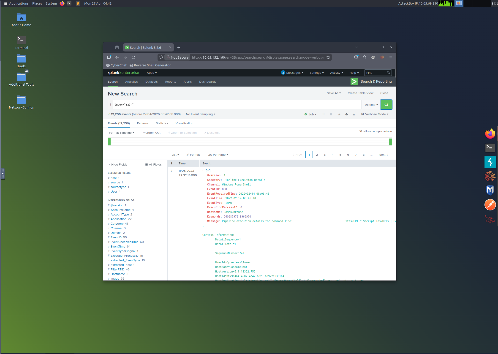

---

### Tarefa 2 — Usuário backdoor criado

O EventID **4720** no Windows indica a criação de uma nova conta de usuário. Filtrei diretamente por esse evento.

**Query utilizada:**
```spl
index="main" EventID=4720
```

**Resultado:** Conta `A1berto` criada no host `Micheal.Beaven`, pelo usuário `James` no domínio `Cybertees`. A conta foi criada com **Account Disabled** e sem senha definida — comportamento típico de persistência via backdoor.

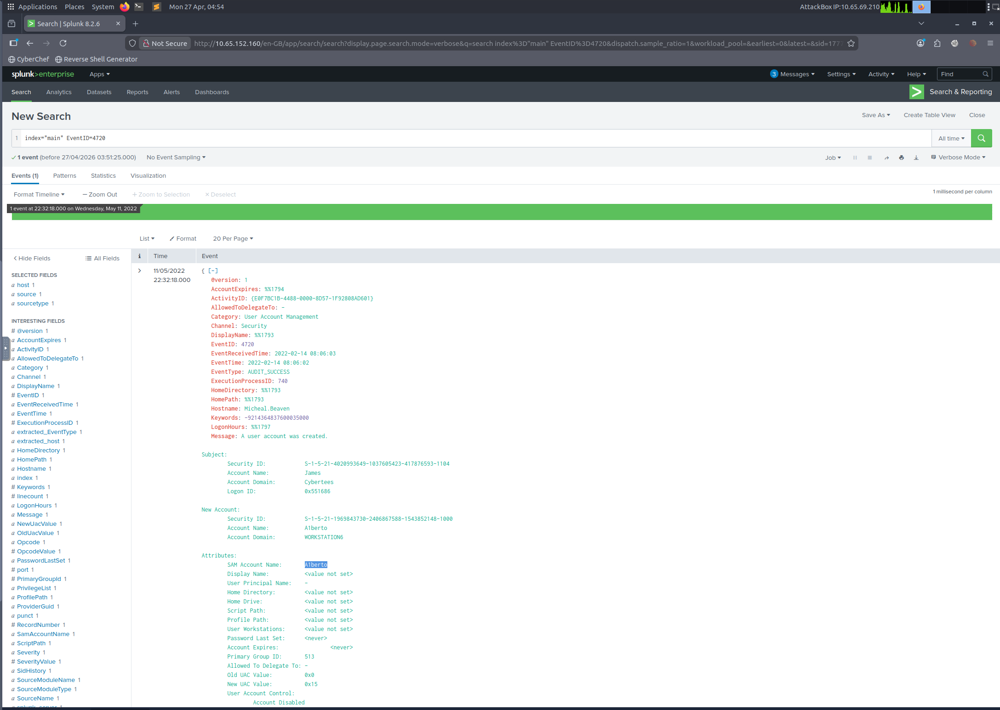

---

### Tarefa 3 — Chave de registro modificada

Combinei o hostname do host comprometido com o nome do usuário backdoor para localizar eventos de modificação de registro (Sysmon EventID 12 — `CreateKey`).

**Query utilizada:**
```spl
index=main Hostname="Micheal.Beaven" "A1berto"
```

**Resultado:** A chave de registro criada foi:
```
HKLM\SAM\SAM\Domains\Account\Users\Names\A1berto
```
Processo responsável: `lsass.exe` — indicando manipulação direta do banco SAM.

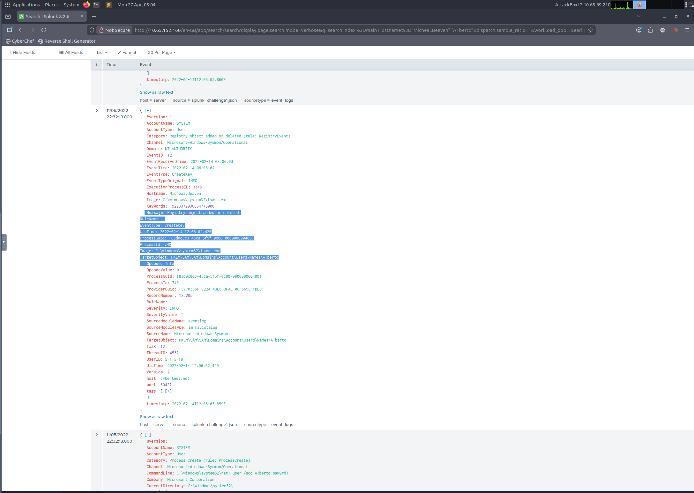

---

### Tarefa 4 — Usuário legítimo sendo impersonado

Listei todos os usuários presentes nos logs para identificar qual nome o atacante tentou imitar.

**Query utilizada:**
```spl
index=main
| stats count by User
```

**Resultado encontrado:**

| Usuário | Eventos |
|---------|---------|
| Cybertees\Alberto | 24 |
| Cybertees\James | 5 |
| NT AUTHORITY\NETWORK SERVICE | 28 |
| NT AUTHORITY\SYSTEM | 70 |

O usuário legítimo era **Alberto**. O atacante criou **A1berto** (com número "1" no lugar do "l") — técnica clássica de *typosquatting* para dificultar a detecção visual.

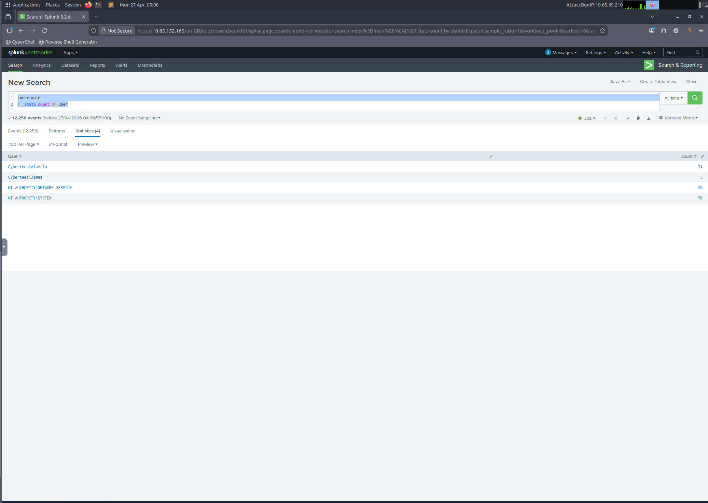

---

### Tarefa 5 — Comando de criação do backdoor via acesso remoto

Filtrei os logs do canal Security associados ao usuário backdoor para encontrar o comando exato usado.

**Query utilizada:**
```spl
index=main Channel="Security" "A1berto"
```

**Resultado:** 5 eventos encontrados. O evento de criação de processo (EventID 4688) revelou o comando completo executado via **WMIC** a partir de uma sessão PowerShell:

```
"C:\Windows\System32\Wbem\WMIC.exe" /node:WORKSTATION6 process call create "net user /add Alberto pawOrd1"
```

O comando foi executado remotamente no host `WORKSTATION6` a partir da máquina de `James.browne`, usando WMIC como vetor de execução lateral.

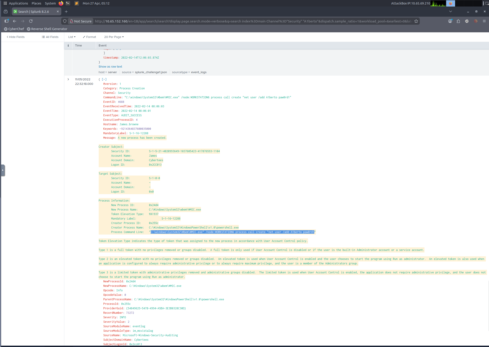

---

### Tarefa 6 — Tentativas de login do usuário backdoor

O EventID **4624** representa logon bem-sucedido no Windows. Verifiquei no campo EventID dos 5 eventos da busca anterior.

**Resultado:** Nenhum evento 4624 encontrado para `A1berto`. O campo EventID apresentou apenas os valores `4688`, `4720` e `4726` — confirmando que **nenhuma tentativa de login foi realizada** com o usuário backdoor durante o período investigado.

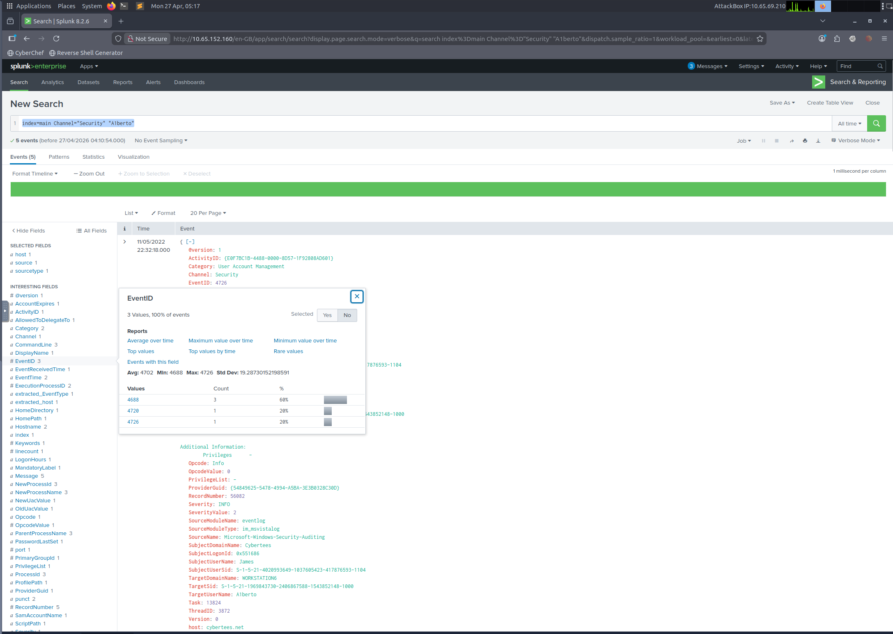

---

### Tarefa 7 — Host com execução de PowerShell suspeito

A análise dos eventos anteriores já indicava o host responsável. O evento de criação de processo (Tarefa 5) registrou o campo `Hostname` explicitamente.

**Resultado:** Host infectado com PowerShell malicioso: **`James.browne`**

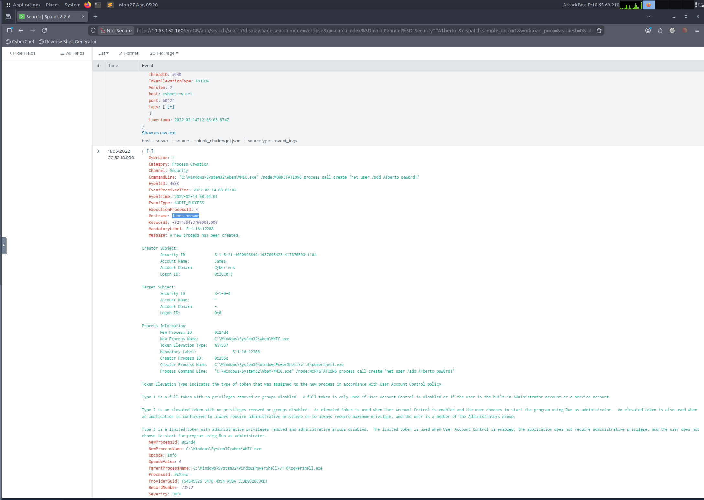

---

### Tarefa 8 — Total de eventos do PowerShell malicioso

Listei todos os canais de log disponíveis para identificar o volume de eventos do canal de PowerShell Operacional.

**Query utilizada:**
```spl
index=main
| stats count by Channel
```

**Resultado dos canais:**

| Canal | Eventos |
|-------|---------|
| Microsoft-Windows-PowerShell/Operational | 79 |
| Microsoft-Windows-Sysmon/Operational | 5883 |
| Security | 6138 |
| Windows PowerShell | 92 |
| ... | ... |

**Eventos de PowerShell malicioso:** `79`

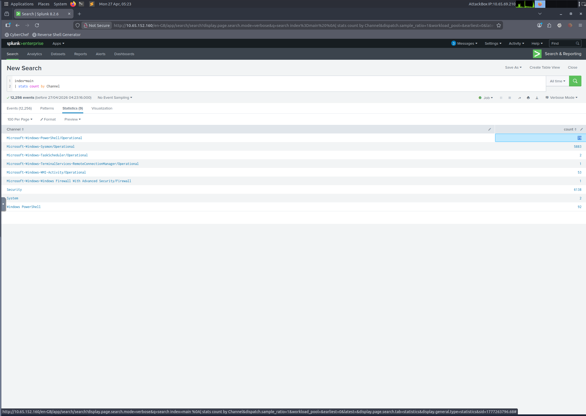

---

### Tarefa 9 — URL completa do C2 no payload ofuscado

Esta foi a etapa mais técnica da investigação. Ao examinar os 79 eventos do canal `Microsoft-Windows-PowerShell/Operational`, encontrei um payload ofuscado em **Base64** embutido em um comando PowerShell com múltiplas camadas de encoding.

**Query utilizada:**
```spl
index=main Channel="Microsoft-Windows-PowerShell/Operational"
```

**Processo de decodificação no CyberChef:**

**Etapa 1 — Decodificação Base64 + remoção de null bytes:**
O payload principal estava codificado em Base64 com null bytes intercalados (padrão de encoding UTF-16 LE do PowerShell). Utilizei a receita:
- `From Base64`
- `Remove null bytes`

O resultado revelou um script PowerShell completo com uma segunda camada de encoding.

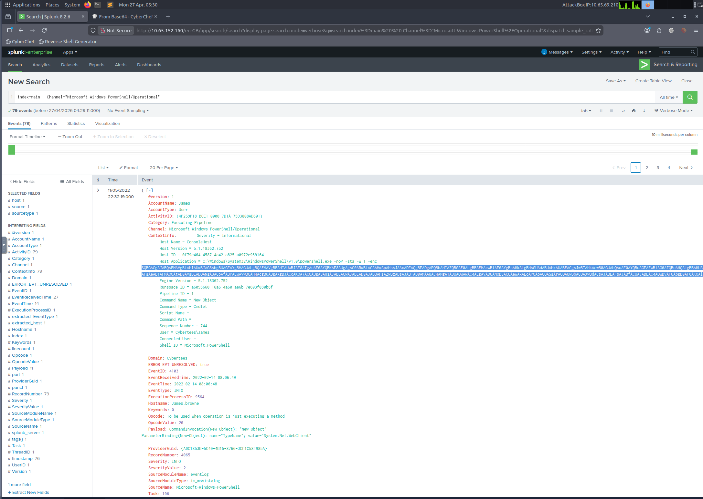

**Etapa 2 — Segunda decodificação Base64:**
Dentro do script decodificado, havia uma string adicional em Base64:
```
aAB0AHQAcAA6AC8ALwAxADAALgAxADAALgAxADAALgA1AA==
```
Decodificando com o mesmo processo: `http://10.10.10.5`

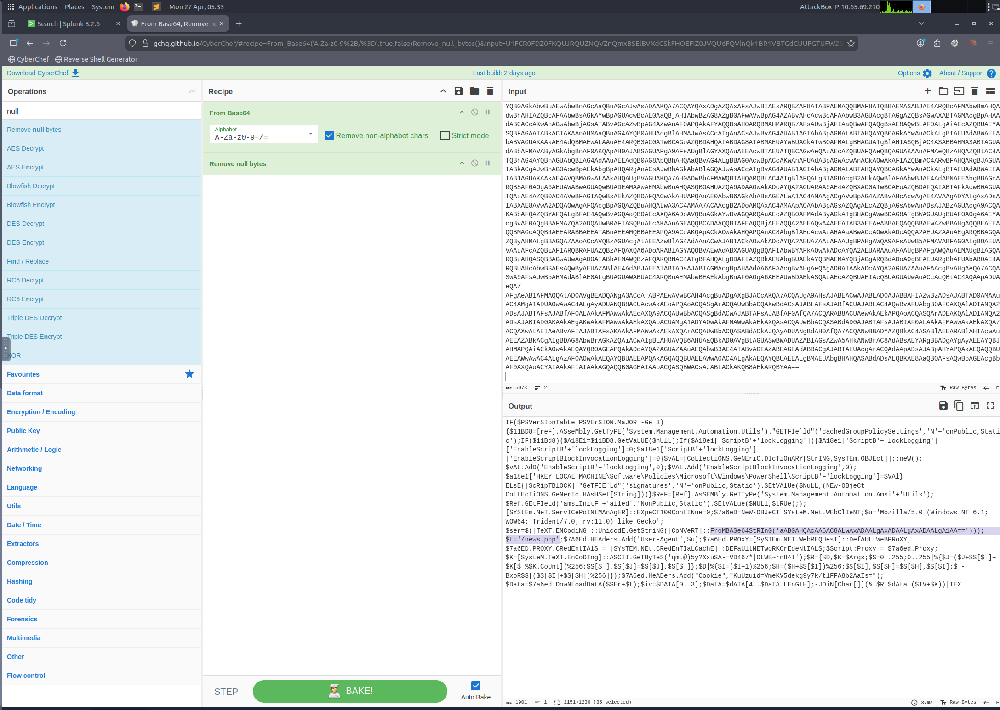

**Etapa 3 — URL completa:**
O path `/news.php` estava concatenado no script original, resultando na URL completa:
```
http://10.10.10.5/news.php
```

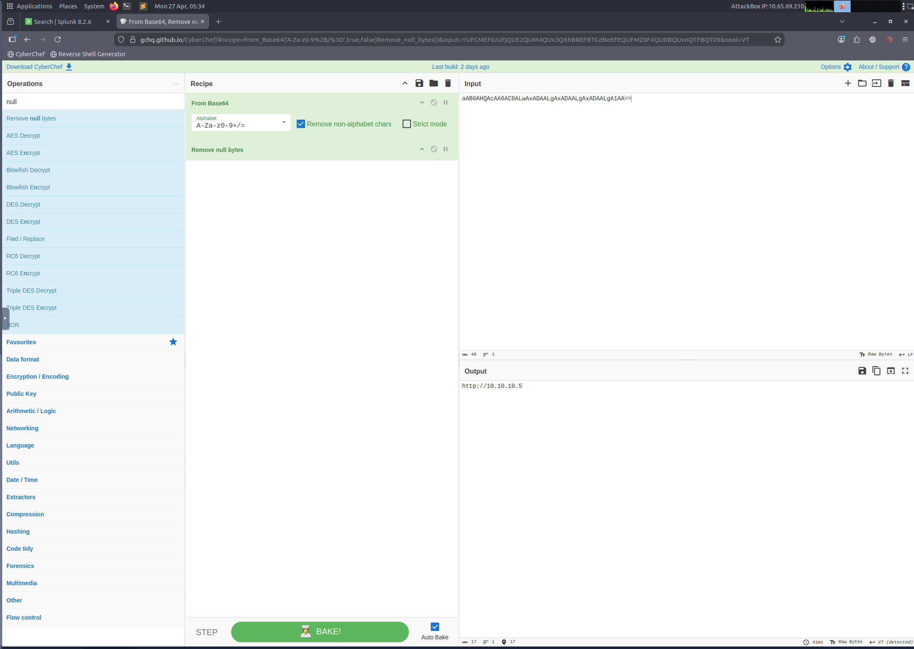

**Etapa 4 — Defang da URL (flag final):**
Aplicei o operador `Defang URL` no CyberChef para obter o formato seguro exigido pelo desafio:
```
hxxp[://]10[.]10[.]10[.]5/news[.]php
```

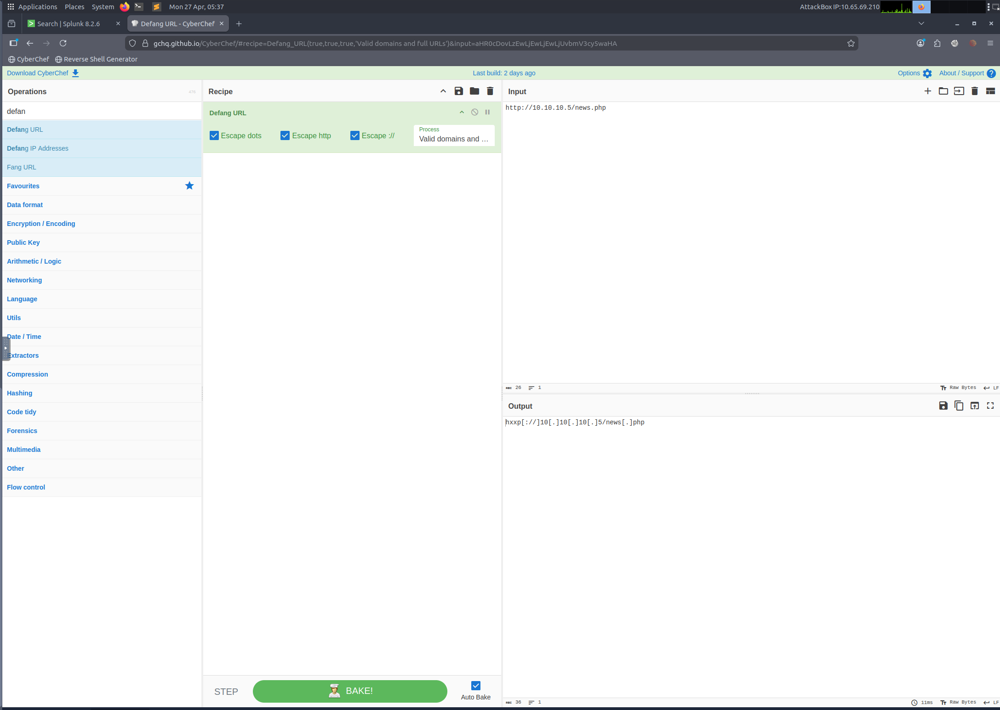

---

## 🧠 Conceitos Aprendidos

**SIEM & Log Analysis**
- Navegação e construção de queries em SPL (Search Processing Language)
- Uso de `stats count by` para enumeração de campos e correlação de entidades
- Filtragem combinada por múltiplos campos (Channel, Hostname, EventID, User)

**Windows Event IDs relevantes**
- `4720` — Criação de conta de usuário
- `4624` — Logon bem-sucedido
- `4688` — Criação de novo processo
- `4726` — Exclusão de conta de usuário
- `12 (Sysmon)` — Criação/deleção de chave de registro

**Técnicas de ataque identificadas (MITRE ATT&CK)**
- `T1136.001` — Create Account: Local Account (criação de backdoor)
- `T1112` — Modify Registry (chave SAM modificada)
- `T1021.003` — Remote Services: DCOM/WMI (WMIC remoto)
- `T1059.001` — Command and Scripting Interpreter: PowerShell
- `T1027` — Obfuscated Files or Information (Base64 multi-layer)
- `T1571` — Non-Standard Port / C2 via HTTP

**Análise forense de payload**
- Identificação de encoding UTF-16 LE (null bytes entre caracteres)
- Decodificação de payloads PowerShell em múltiplas camadas Base64
- Uso do CyberChef para análise forense de strings ofuscadas
- Defang de URLs para compartilhamento seguro de IOCs

---

## 📊 Resumo dos IOCs (Indicators of Compromise)

| Tipo | Valor |
|------|-------|
| Usuário backdoor | `A1berto` |
| Host comprometido (criação) | `Micheal.Beaven` |
| Host comprometido (execução) | `James.browne` |
| Chave de registro | `HKLM\SAM\SAM\Domains\Account\Users\Names\A1berto` |
| Comando de persistência | `net user /add Alberto pawOrd1` |
| Vetor de execução lateral | `WMIC.exe /node:WORKSTATION6` |
| C2 URL | `hxxp[://]10[.]10[.]10[.]5/news[.]php` |
| Usuário impersonado | `Alberto` (Cybertees) |

---

## 🔗 Referências

- [TryHackMe — Investigating with Splunk](https://tryhackme.com/room/investigatingwithsplunk)
- [Splunk SPL Documentation](https://docs.splunk.com/Documentation/Splunk/latest/SearchReference/WhatsInThisManual)
- [CyberChef](https://gchq.github.io/CyberChef/)
- [MITRE ATT&CK — Technique T1136](https://attack.mitre.org/techniques/T1136/)
- [Windows Security Event IDs — Microsoft](https://docs.microsoft.com/en-us/windows/security/threat-protection/auditing/event-4720)

---

<div align="center">

Feito por **Matheus Lima** | AWS Re/Start — Escola da Nuvem  
[](https://github.com/Matheuslimabjj/EDN-AWS)
[](https://linkedin.com/in/)

</div>

